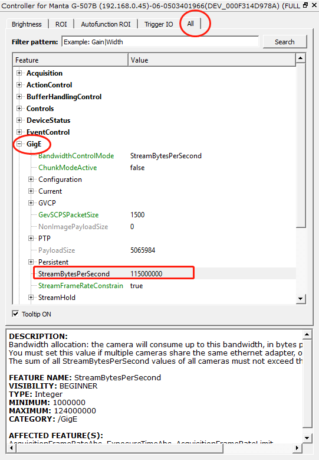

# 通过交换机连接多个相机问题

### 在大多数的情况下，我们建议相机一对一直连到PC端的网口。

### 但也有客户（PC端可用网口不够）希望通过交换机，一个PC网口连接多台相机。这也是可行的，但要注意以下两点：
    * 相机的IP地址要与网口在同一地址段、且各不相同
    * 为了防止带宽冲突，要限制每个相机占用的带宽。通过交换机连接到同一PC网口各个相机的带宽之和不能超过124M。

### 在Vimba viewer里设置请参考下图   

