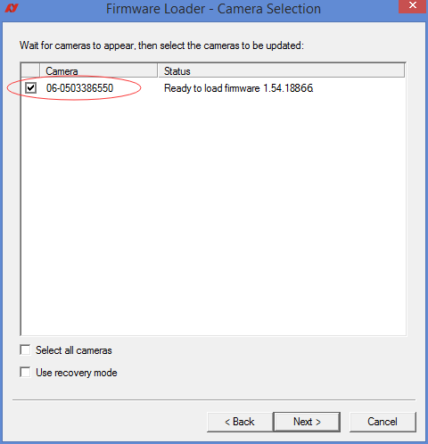
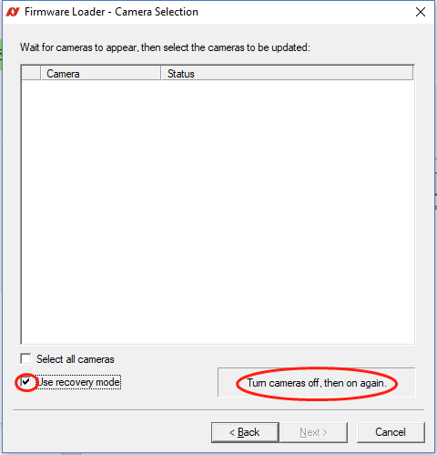
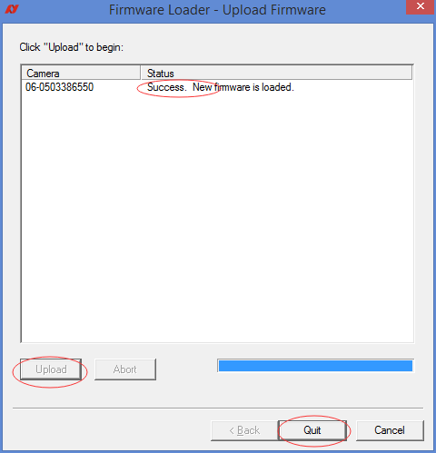

相机升级/导入固件(Firmware_Upgrade)
---

## 1. 确保网络设置/相机连接正常

## 2. 双击运行附件所带的版本升级软件
  

以上相机固件可以从Allied Vision官网进行[下载](http://china.alliedvision.com/cn/%E6%8A%80%E6%9C%AF%E6%94%AF%E6%8C%81/%E5%9B%BA%E4%BB%B6%E4%B8%8B%E8%BD%BD.html)。

## 3. 选择“下一步”，再“下一步”，出现如下界面

### 勾选需要升级的相机后，点击“下一步”

### 网络正常的前提下，如果找不到相机，可以选择“Use recovery mode”,软件保持不关闭的前提下断电重启相机（如果一次不行，多重启几次）建议在单网卡系统上做以上修复

## 4. 点击“Upload”按钮，等待升级（过程中要保证网络和供电正常）

## 5. 升级成功后点击“Quit”退出程序

* 注意：相机固件升级完毕后，相机内部所有参数将恢复到默认状态。
