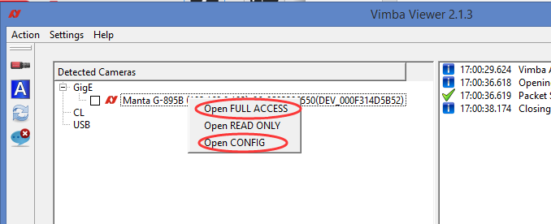
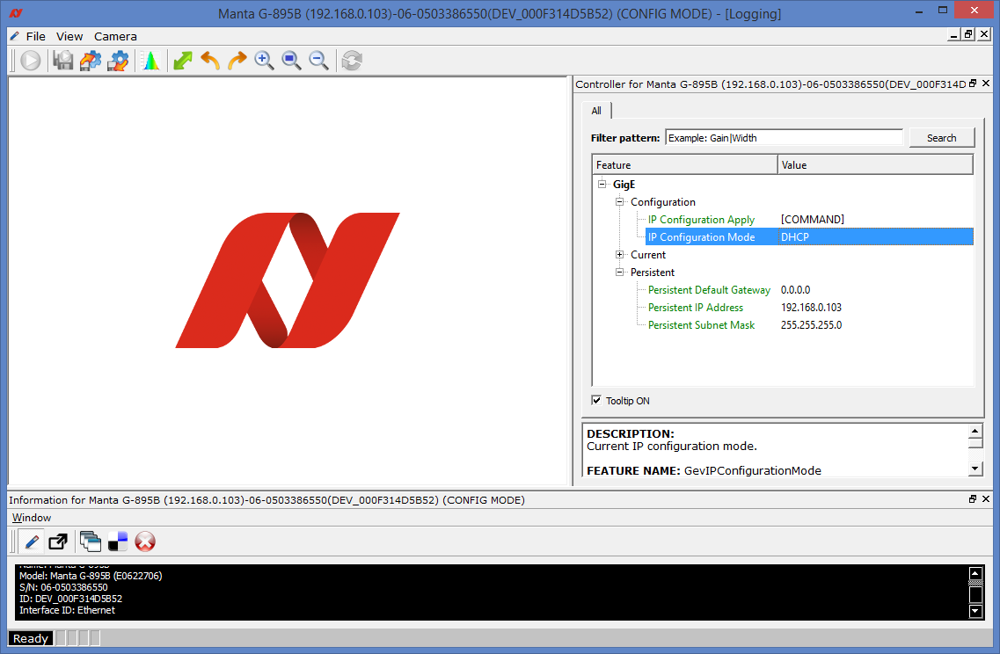
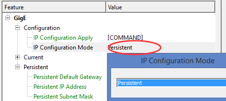
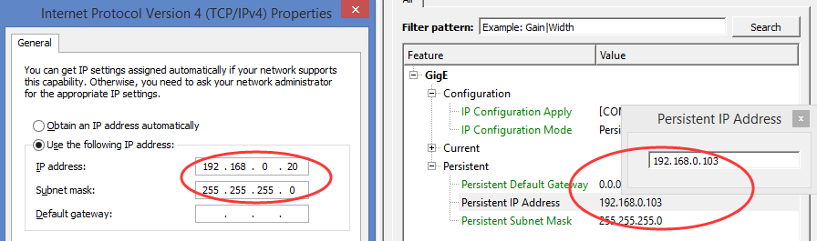
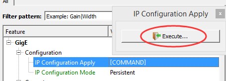

# 使用Vimba viewer配置相机IP - Vimba Viewer
## 1. 进入IP配置界面 
### 1.1 右键相机列表上的相机，会弹出一个菜单，如下图所示：

##### 如果相机IP配置不对，则只显示“Open CONFIG”，如果相机被占用，则只有“Open READ ONLY”
### 1.2 选择“Open CONFIG”,进入IP配置界面

## 2. 配置IP
### 2.1 点击“IP Configuration Mode”的“Value”区域，在弹出的菜单中选择“Persistent”（固定IP）

### 2.2 点击“Persistent IP Address”的“Value”区域，在弹出的输入框中输入正确的IP（要与本地连接IP设置在同一网段）

### 2.3 改好后先按回车键，再关闭输入框
## 3.保存IP
### 3.1 点击“IP Configuration Apply”的“Value”区域，点击弹出的“Execute”, IP设置就保存好了

#### 如果本地连接是自动获取IP模式，相机可以配置成自动获取模式，只需在"2.1"选择“DHCP”后直接执行3，但我们建议配置成固定模式，尤其是多相机的情况下
### 通过配置模式设置的相机IP是非易失性的，断电重启后依然有效，无需保存在用户设置里

## 4.最后的尝试：如果在一直无法在电脑的Vimba Viewer中找到相机，还能怎么做？
有时候即使电脑端网卡设置正确，网线、电源等硬件也正常的情况下，因为无法确认相机端的IP设置模式，怎么也无法连接到相机。
此时可以尝试升级相机固件的方法，来恢复相机的内部状态，同时也会将相机的IP模式恢复到出厂设置-DHCP动态IP模式。

