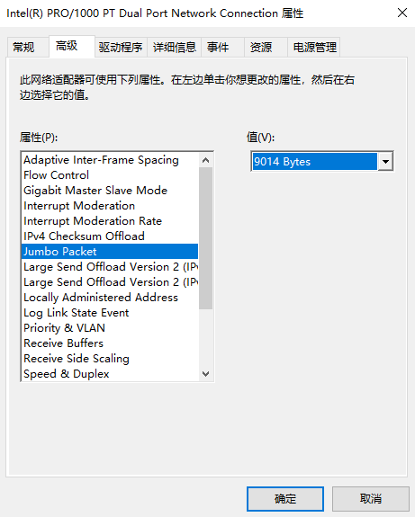

#为AVT千兆网相机安装Intel原厂网卡驱动程序

## 下载Intel网卡的原厂驱动程序安装包

可以访问Intel网站获取最新版本的Intel网卡驱动安装包，同时可以参考下面的安装指导：  

> How to Manually Install Intel® Network Adapter Drivers in Windows*
> https://www.intel.com/content/www/us/en/support/articles/000022174/network-and-i-o.html 

例如，下面是常用的Intel驱动Win7, Win8 和 Win10安装包的下载链接：
* https://downloadcenter.intel.com/download/18713/Intel-Network-Adapter-Driver-for-Windows-7
* https://downloadcenter.intel.com/download/21642/Intel-Network-Adapter-Driver-for-Windows-8-Final-Release
* https://downloadcenter.intel.com/download/25016/Intel-Network-Adapter-Driver-for-Windows-10

## 卸载当前网卡驱动

为了避免旧驱动的影响，最彻底的方法的卸载方法是，打开Windows的`设备管理器(Device Manager)`找到对应的网卡硬件，例如下图中的网卡：Intel(R) Ethernet Connection I219-LM

点击右键盘，选择`Uninstall Device(删除硬件)`来彻底删除此硬件。
重起电脑，再使用设备管理器重新找到这个网卡。
此时一般量使用的是Windows系统自带驱动。

## 安装Intel原装网卡驱动
在最开始的介绍中，如果你已经下载了Intel原装驱动安装包，可以直接点击运行，例如`PROWinx64.exe`.
注意要使用管理员权限来运行此程序，按提示一直安装成功为止。

## 优化网卡性能

### 巨帧（Jumbo Packet）
对于工业相机的使用场景，一般需要打开网卡驱动中的`巨帧(Jumpo Packet)`功能，并选取最大值，例如9014 Bytes.

### 相机驱动
使用`Vimba Driver Installer`可以为网卡驱动安装一个优化插件`Allied Vision GigE Filter`.
这个插件可以提高AVT GigE相机的数据传输性能，减少CPU占用。

