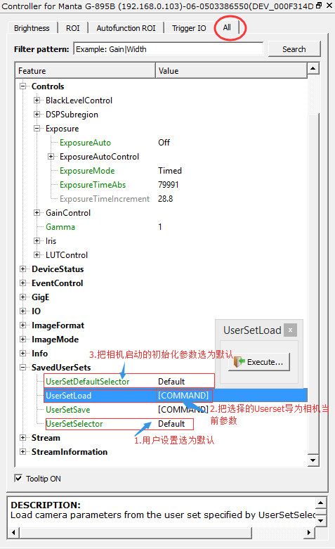

恢复出厂设置/默认设置
---

## 在Vimba Viewer里恢复默认设置可以参考下图:
  

经过以上操作后，可以将相机断电重起，再打开Vimba Viewer来确认相机参数是否已经恢复到默认状态。

## 另一种方式是通过升级/导入固件的方式，具体可以参考《如何升级/导入固件（Firmware_Upgrade）》
[《如何升级/导入固件（Firmware_Upgrade）》](FirmwareUpgrade/Firmware_Upgrade.md)
