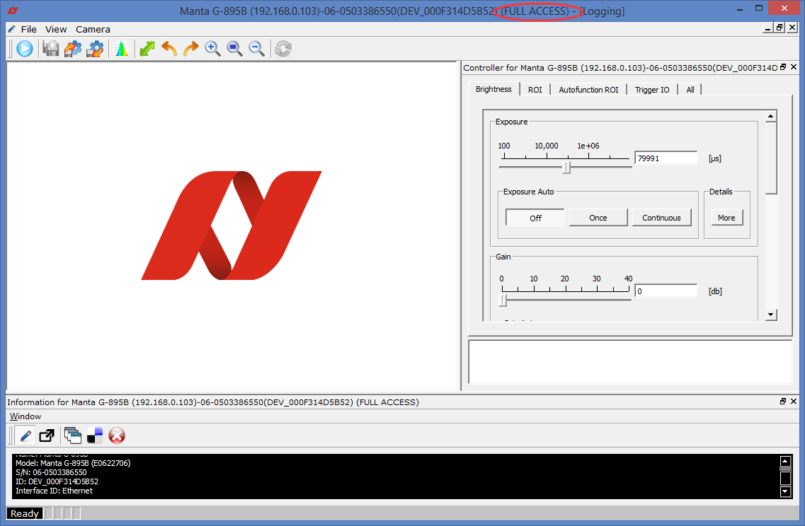
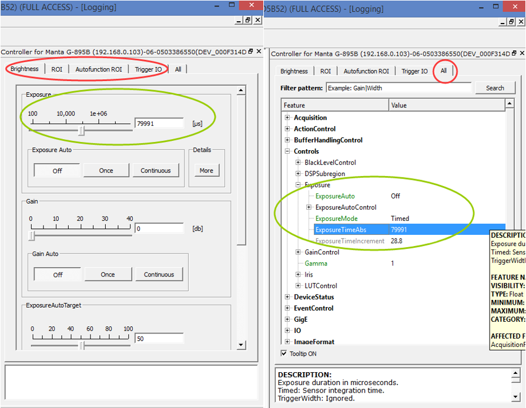

## 保存用户设置到相机

#### 使用AVT相机的时候，你肯定遇到过这种现象：
##### 在Vimba Viewer里设置了相关参数，但是相机一断电重启就全部恢复默认了
##### 这是因为你没有把用户设置保存到相机里
### 正确的保存方法如下：
### 1.单击相机列表里的相机，进入相机控制界面
（如果不是FULL ACCESS,请关闭当前页面检查IP配置或相机是否被占用）

#### 特别说明
在Brightness、ROI等选项卡页面设置的参数值和All选项卡页面里的参数值是一一对应并且同步的，只需要改其中一个地方的参数就可以了

### 2.修改并保存用户设置

#### 不同的相机支持的UserSet数量可能不同，每个UserSet就是保存在相机里（ROM）的一套配置参数
只修改参数不点保存，会影响当前运行参数（放在相机RAM），但是断电重启后参数失效
“UserSetDefaultSelector”选择初始化设置参数,相机上电启动时会把初始化设置参数导入到当前运行参数（RAM）
