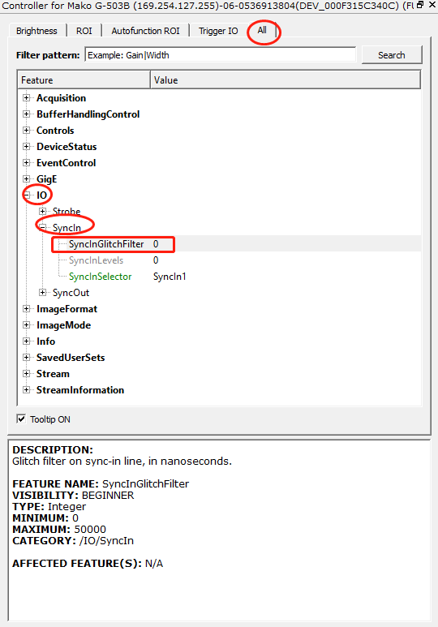

## 关于相机硬件误触发的问题，可以通过相机设置来解决问题。
### 通过设置相机输入信号的防跳变时间：SyncInGlitchValue，单位为ns

#### 例如你的相机的trigger signal脉宽是2us，noise脉冲最大脉宽是50ns，你可以设置 SyncInGlitchValue=100 ，这样可以过滤掉误触发信号。
### 在噪声比较多的情况下，如果相机支持多个输入（TTL和Opto-isolated），则优先使用Opto-isolated
TTL为输入电平触发，Opto-isolated为光耦隔离触发（触发延时会比TTL多15us左右）
