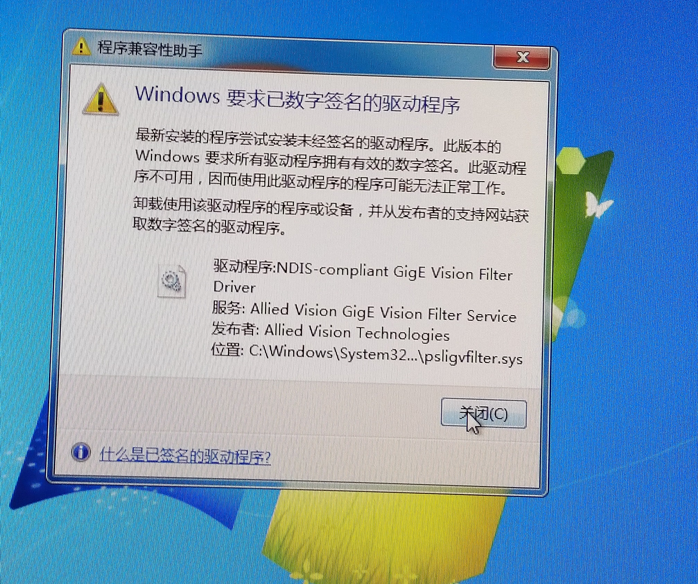

# Win7 64位系统 找不到相机或安装AVT驱动程序报错

## 现象
* Vimba安装过程报错
* 安装过程不报错，但在本地连接已连接的状态下找不到相机

## 根本原因
较旧的Win7 X64的系统会有一个强制的驱动程序数字签名认证BUG，会导致相机驱动程序安装失败

## 解决办法
先卸载Vimba,在微软官网下载并安装KB3033929补丁，打完补丁后再安装Vimba就可以了

## 补丁下载地址：
https://www.microsoft.com/en-us/download/confirmation.aspx?id=46148

补丁文件百度盘下载地址： [Windows 7 for x64-based Systems (KB3033929)](https://pan.baidu.com/s/1xzrCMC49ALuG5jBoZ1EGMQ)

