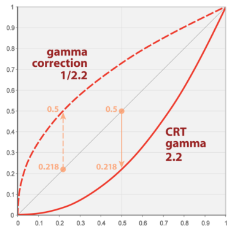
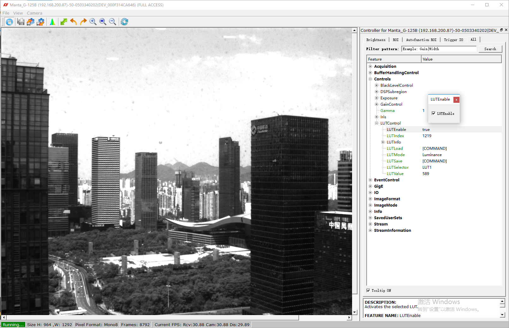

Manta 相机LUT查找表设置Gamma 1.6, 2.0的方法
---

# AVT相机Gamma及LUT功能介绍
  
AVT相机未经过Gamma/LUT处理的原始图像是由上图中的45度直线映射获得的。  
另外两条实线，虚线分别是Gamma = 2.2 和 Gamma = 1/2.2 。 


# LUT文件数据

数据文件的格式如下图。具体可以参考 LUT数据文件[lut-joe-mako-1.6-and-2.0.csv](lut-joe-mako-1.6-and-2.0.csv)。
其中第0列为0~4095，相当于Gamma = 1，第4列为 Gamma = 1.6，第6列为 Gamma = 2.0。
客户可以根据规律来自己生成特定的LUT/Gamma数据。
`注意:` CSV文件用分号（;）而不是逗号（,）分隔。

```
0;0;0;0.000;0;0;0;
1;1;1;0.007;0;0;0;
2;2;3;0.021;0;0;0;
3;3;6;0.039;0;0;0;
4;4;9;0.063;0;0;0;
...
...
4086;4086;599898;4080.606;4081;4081;4077;
4087;4087;600133;4082.204;4082;4082;4079;
4088;4088;600368;4083.803;4084;4084;4081;
4089;4089;600603;4085.401;4085;4085;4083;
4090;4090;600838;4087.000;4087;4087;4085;
4091;4091;601073;4088.599;4089;4089;4087;
4092;4092;601308;4090.198;4090;4090;4089;
4093;4093;601543;4091.797;4092;4092;4091;
4094;4094;601778;4093.397;4093;4093;4093;
4095;4095;602014;4094.997;4095;4095;4095;
```


# LUT数据文件导入
LUT数据文件[lut-joe-mako-1.6-and-2.0.csv](lut-joe-mako-1.6-and-2.0.csv)目前含有Gamma 1.6和Gamma 2.0的数据文件，分别在第4和6列（第一列号为0）。以下使用我们的`LookUpTable.exe`程序导入Gamma 2.0的数据到相机flash中。 

* 目录: `c/Users/Public/Documents/Allied Vision/Vimba_3.0/VimbaNET_Examples/LookUpTable/Build/VS2010/Win32/Debug` 
* 命令：`./LookUpTable.exe /i:0 /lc:6 /f:"lut-joe-mako-1.6-and-2.0.csv"`

```
./LookUpTable.exe /i:0 /lc:6 /f:"lut-joe-mako-1.6-and-2.0.csv"

///////////////////////////////////////
/// Vimba API Look Up Table Example ///
///////////////////////////////////////

Vimba .NET API Version 1.8.0
Camera ID: DEV_000F315C203B

Look up table successfully loaded from CSV.
```

# LUTEnable 打开或者关闭LUT功能

* `LUTEnable 选中 - `：LUTControl中的LUT1数据生效；
* `LUTEnable 未选`：Gamma 值生效，缺省为1；  
另外，为了保证以上导入的LUT数据在相机断电之后仍然保存在相机中以便再次使用： 
* `LUTSaveAll`：使用此命令永久保存LUT数据到相机Flash中。

## LUTEnable 未选 (使用 原始的 Gamma 1.0 效果)


## LUTEnable 选中 (使用 LUT Gamma 1.6 效果)



# LookUpTable.exe 使用说明

* 目录: `c/Users/Public/Documents/Allied Vision/Vimba_3.0/VimbaNET_Examples/LookUpTable/Build/VS2010/Win32/Debug`
* 命令：`./LookUpTable.exe /h`

```
./LookUpTable.exe /h

///////////////////////////////////////
/// Vimba API Look Up Table Example ///
///////////////////////////////////////

Usage: LookUpTable.exe [CameraID] [/i:Index] [/h] 
        [/{s|l|sc|lc:Column|u|d|v(:Value)|e(:Enable)|bi|bo|n}] [/f:FileName]

Parameters:   CameraID       ID of the camera to use
                             (using first camera if not specified)
              /i:Index       Set look up table index
              /h             Print out help
              /s             Save look up table to flash
              /l             Load look up table from flash
              /sc            Save look up table to Csv
                             (Look up table previously downloaded)
              /lc:Column     Load look up table from Csv using specified column
                             (Look up table uploaded afterwards)
              /e:Enable      Set look up table enable [on/off]
              /e             Get look up table enable
                             (default if not specified)
              /v:Value       Set look up table value
              /v             Get look up table value
              /bi            Get look up table bit depth in
              /bo            Get look up table bit depth out
              /n             Get look up table count
              /f:FileName    File name for operation

For example to load a look up table from the csv file C:\lut.csv and
write it to the camera's flash as LUT1 call

LookUpTable.exe /i:0 /lc:0 /f:"C:\lut.csv"

To load the look up table LUT2 from the camera and write it
to the csv file C:\lut.csv call

LookUpTable.exe /i:1 /sc /f:"C:\lut.csv"
```


