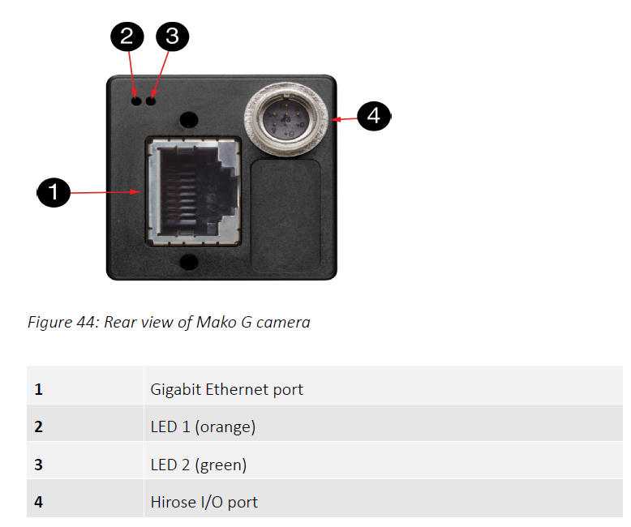
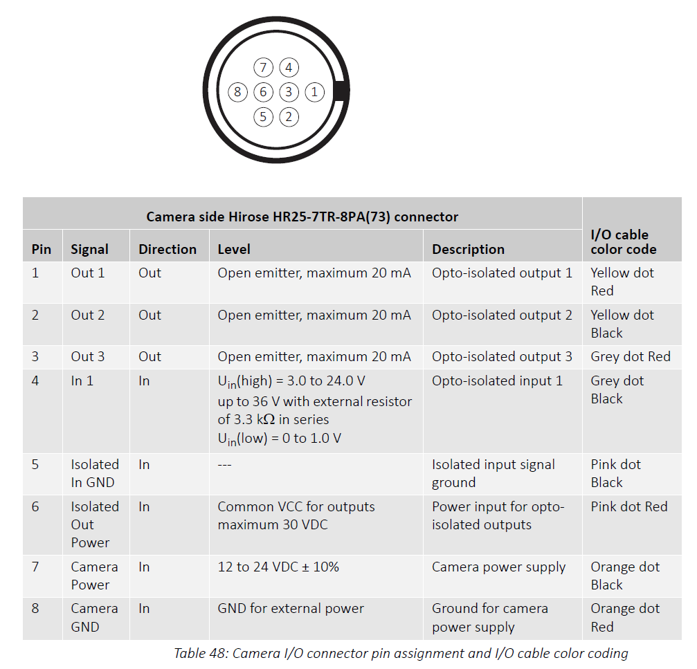
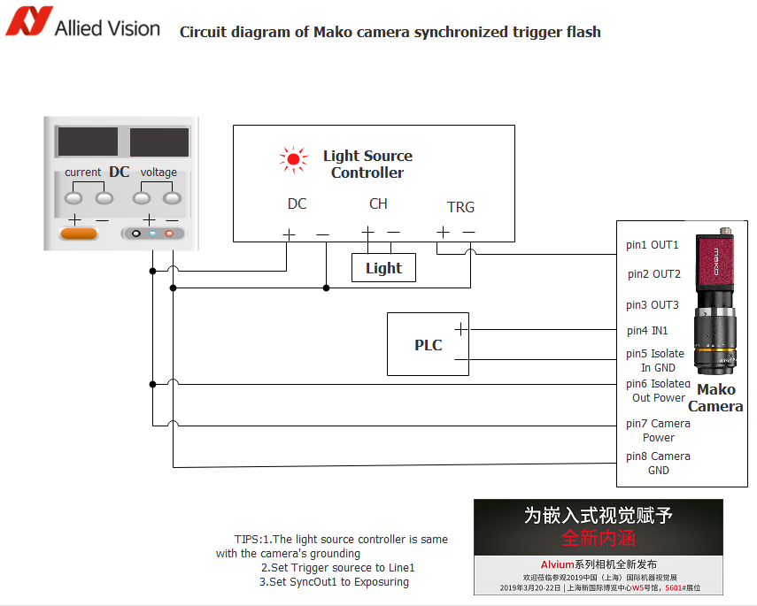

#AVT相机外部触发设置方法

## Mako相机外触发设置

### Mako G尾部结构 
Mako G系列千兆网相机的外部触发接口位于尾部的8PIN Hirose接口中，如下图中4号位置：

### Mako G 8Pin Hirose接口
8PIN Hirose接口的定义如下：

### Mako G 外触发接线
Mako G系列相机的外触发1口，可以接Pin4和Pin5，参考下图接线方法：
 

更多详细技术信息，请查看Mako G相机的技术手册：
http://china.alliedvision.com/fileadmin/content/documents/products/cameras/Mako/techman/Mako_TechMan_en.pdf

## Manta相机外触发设置

与Mako G系列类似，详细接口及线序定义请查看Manata系列相机的技术文档：
http://china.alliedvision.com/fileadmin/content/documents/products/cameras/Manta/techman/Manta_TechMan.pdf
