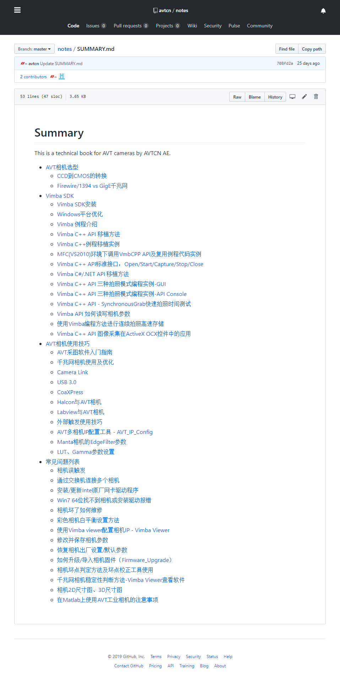

# 说明  

This is public technical documents portal by AVTCN AE team.   
You can view content directory through link below:  
https://github.com/avtcn/notes/blob/master/SUMMARY.md

Such as topics as below:   
  
[](https://github.com/avtcn/notes/blob/master/SUMMARY.md)


## 其他  
[解决github无法访问或排版图片出错等问题](https://ayunnn.github.io/2019/05/17/20190517%E8%A7%A3%E5%86%B3github%E6%97%A0%E6%B3%95%E8%AE%BF%E9%97%AE%E6%88%96%E6%8E%92%E7%89%88%E5%9B%BE%E7%89%87%E5%87%BA%E9%94%99%E7%AD%89%E9%97%AE%E9%A2%98/)

### 修改hosts文件
hosts文件的路径是`C:\Windows\System32\drivers\etc\hosts`  
在hosts文件最后添加一行IP和域名，比如`192.30.253.112 github.com`，保存即可(需要管理员权限才能保)。  
下面是目前可用的hosts代码：  
```
# GitHub Start
192.30.253.112 github.com
192.30.253.119 gist.github.com
151.101.100.133 assets-cdn.github.com
151.101.100.133 raw.githubusercontent.com
151.101.100.133 gist.githubusercontent.com
151.101.100.133 cloud.githubusercontent.com
151.101.100.133 camo.githubusercontent.com
151.101.108.133 avatars0.githubusercontent.com
151.101.108.133 avatars1.githubusercontent.com
151.101.108.133 avatars2.githubusercontent.com
151.101.108.133 avatars3.githubusercontent.com
151.101.108.133 avatars4.githubusercontent.com
151.101.108.133 avatars5.githubusercontent.com
151.101.108.133 avatars6.githubusercontent.com
151.101.108.133 avatars7.githubusercontent.com
151.101.108.133 avatars8.githubusercontent.com
# GitHub End
```

## 联系方式  

support@alliedvision.com


---
2019-11-07 11:29:27 updated.


