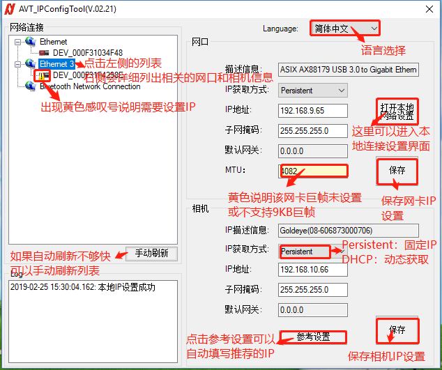
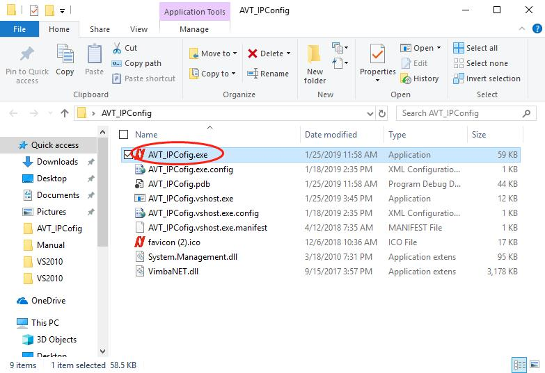

# AVT多相机IP配置工具 - AVT_IP_Config

## 简介
### 主界面及主要功能如下：

### 主界面及主要功能如下：
## 下载及使用AVT相机IP配置工具

点击下载zip压缩文件，然后解压到一个目录，并运行 `AVT_IPCofig.exe`

[:arrow_double_down:下载 AVT IP 配置工具（Vimba2.1.3版本）:arrow_double_down:](https://github.com/avtcn/notes/blob/master/skills/avt_ip_config/AVT_IPConfig.zip)
[:arrow_double_down:下载 AVT IP 配置工具（Vimba3.1版本）:arrow_double_down:](https://github.com/avtcn/notes/blob/master/skills/avt_ip_config/AVT_IPConfig3.1.zip)

## 其它
使用软件需要下载并安装Vimba 软件
如程序不能正常直接启动或其它异常，请及时联系我们

By Lemon
