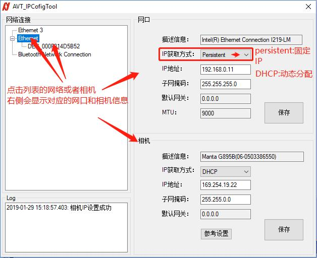
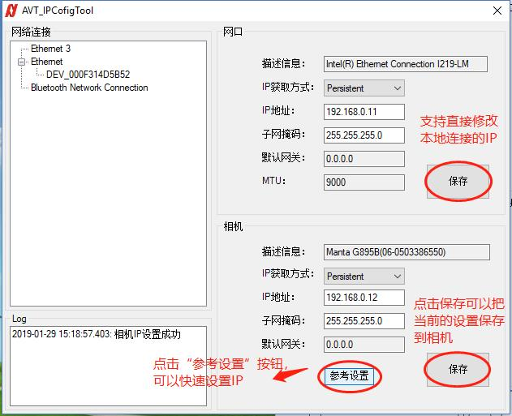

# AVT_IP_Config AVT多相机IP配置工具

## 简介
### 主界面及主要功能如下：

## 下载及使用AVT相机IP配置工具

点击下载zip压缩文件，然后解压到一个目录，并运行 `AVT_IPCofig.exe`

[下载AVT IP配置工具](https://github.com/avtcn/notes/raw/master/skills/avt_ip_config/AVT_IPConfig-001.zip)
