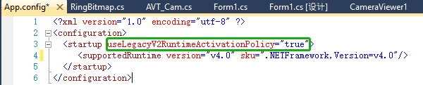
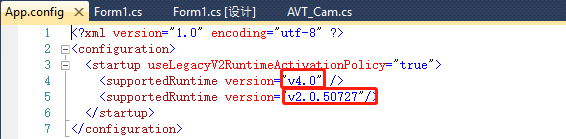

##  本节主要介绍如何使用Vimba .NET API

###* 新建一个C#工程(注意当前的.NET版本）

###* 引用VimbaSDK安装目录下的VimbaNET.dll（dll区分32位和64位的，按系统选择引用）

###* 添加一个用户配置文件，使VimbaNETAPI能在当前的.NET Framework环境下运行(VimbaNET.dll是在.NET 2.0环境下编译的)

###* 引用VimbaNETAPI的命名空间

使用Vimba .NET API的流程就介绍到这里了

### 其它信息
联系 support@alliedvision.com 获取更多帮助。
by Lemon
