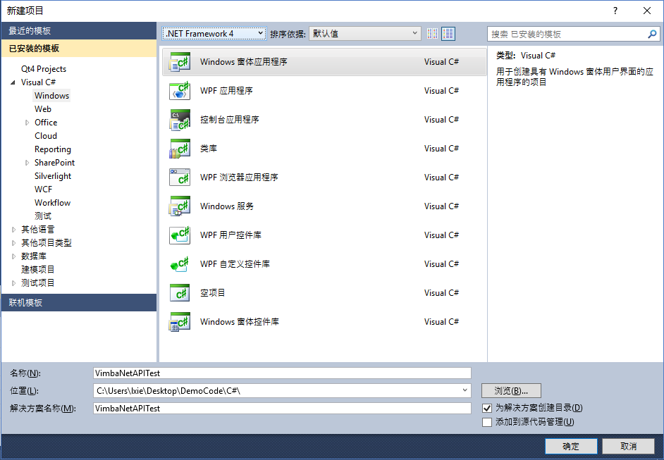
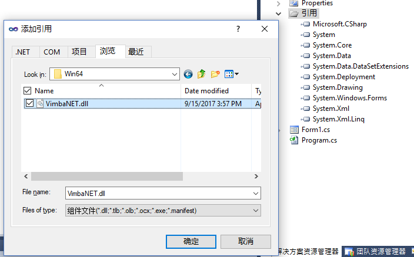
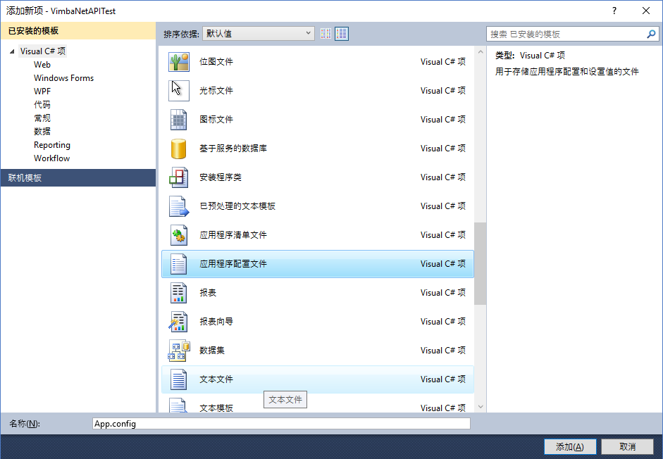
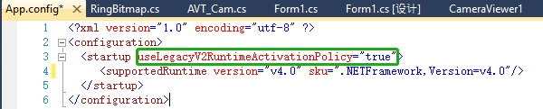
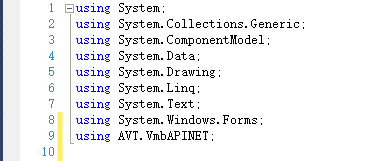

##  本节主要介绍如何使用Vimba .NET API

### 新建一个C#（或VB.NET）工程

### 引用VimbaSDK安装目录下的VimbaNET.dll（dll区分32位和64位的，按系统选择引用）

### 为当前工程添加一个用户配置文件(C#默认没有App.config文件，VB.Net默认有）

### 修改App.config使当前工程支持.NET Framework2.0运行库(VimbaNET.dll是在.NET 2.0环境下编译的)

### 引用VimbaNETAPI的命名空间

使用Vimba .NET API的流程就介绍到这里了
### 参考代码下载
#### VB.Net
https://github.com/avtcn/notes/blob/master/vimbasdk/VimbaNet/AVT_DemoCode_VBNet.zip
#### C#（官方.NET例程所使用语言的是C#）
https://github.com/avtcn/notes/blob/master/vimbasdk/VimbaNet/AVT_DemoCode_CSharp.zip

### 其它信息
联系 support@alliedvision.com 获取更多帮助。

by Lemon
