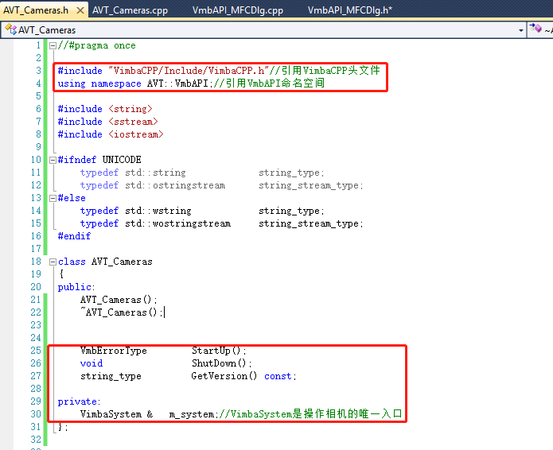

MFC（VS2010）+ Vimba API编程实例
---

## 说明
本文档适合于初次使用Vimba C++API做AVT相机二次开发的工程人员。通过本文档的介绍，可以轻松建立一个调用Vimba C++API的MFC程序，或者将官方例程移植到您既有的项目中

# 1.	准备工作
## 1.1 首先，确认已完全安装Vimba SDK
 

安装可以参考：
[Windows平台下安装Vimba SDK](https://github.com/avtcn/notes/blob/master/vimbasdk/installation.md)  
请留意“Target Folder”以及“Examples Target Folder”的位置
## 1.2 新建一个MFC 对话框工程，命名为“VmbAPI_MFC”

## 1.3 删掉对话框界面不必要的的控件，并启动程序

#### 启动后再停止，进行下一步

# 2.	调用VmbAPI相关的库
## 2.1	将VmbAPI相关的文件拷到工程文件夹（这里主要是为了后面采用相对引用，方便程序的移植）
### 2.1.1 在当前工程文件夹里新建一个“Vimba2.1”文件夹

### 2.1.2 将“Examples Target Folder”里的“Common”文件夹复制到新建的“Vimba2.1”文件夹

### 2.1.3  再将Vimba安装目录下的如下三个文件夹复制到新建的“Vimba2.1”文件夹
 

## 2.2 链接VmbAPI库文件
### 2.2.1	设置“附加包含目录”
相对目录的起点为“.vxcproj”文件所在的目录， 每个“..\”都会向上移动一个目录，可以根据“Vimba2.1”文件夹所在项目的实际位置设置

### 2.2.2	设置“附加库目录”
这里以Win32程序为例， Win32程序在X64平台上也能运行，如果纯X64程序，则引用库目录改成Win64就可以了

### 2.2.3	设置“附加依赖项”

### 2.2.4 将必须的4个动态链接库（dll文件）拷贝到”exe”所在的文件夹内
这四个文件可以从Vimba2.1文件夹对应的Win32平台文件夹里找到，对应的x64程序也有对应的文件夹

# 3.	启动程序调用VmbAPI，并输出当前版本号
## 3.1	新建一个相机控制类，命名为“AVT_Cameras”

### 3.1.1 头文件“AVT_Cameras.h”做如下改动

### 3.1.2	“AVT_Cameras.cpp”实例化“m_system”,并实现对应的方法

## 3.2 调用相机控制类
### 3.2.1 回到主界面的头文件“VmbAPI_MFCDlg.h”，并注意如下改动：

### 3.2.2 主界面“VmbAPI_MFCDlg.cpp” 实现 “启动vimba”->“显示版本”->“退出”

### 3.2.3 运行结果如下：

### 以上代码可以通过如下地址下载：
[VmbAPI_MFC_Simple.zip](https://github.com/avtcn/notes/blob/master/vimbasdk/VmbCPP/VmbAPI_MFC_Simple.zip)

## -----------------------------------------分--割--线------------------------------------------------
## 接下来就可以再做一些相机操作相关的细化流程了，下面我们决定在当前程序的基础上、直接移植官方例子程序的代码

# 4.	官方例程代码移植
## 4.1 准备工作（如果是自己的既有工程，请先参考“2.调用VmbAPI相关的库”）
### 4.1.1将官方异步采图例程的“Source”文件夹拷贝到当前程序文件夹（“Vimba2.1”同一目录）

### 4.1.2精简拷贝进来的“Source”文件夹，保留如下文件：

### 4.1.3再将上述文件添加到当前工程

## 4.2 运行程序，检查移植是否成功
### 4.2.1启动程序，会发现报错

解决办法：报错的三个文件属性设置为“不使用预编译头”

### 4.2.2再次启动程序，会报另一个错误

解决办法：附加包含目录增加拷贝进来的“Source”文件夹

这里说明一下，如果步骤4.1.1直接把4.1.3需要的6个文件拷到与“VmbAPI_MFC.h”同一目录下，则不会报相关错误

## 4.3	调用移植过来的代码
### 4.3.1简单说明：例程移植过来的”ApiController”类的定位和原有的”AVT_Cameras”类是一样的

### 4.3.2删除“AVT_Cameras”类，并引用“ApiController”

## 4.4 接下来就是主界面添加一些控件、以及调用”ApiController”类的一些方法，这里不再详细描述
最终实现的效果如下图：

[代码下载地址：](https://github.com/avtcn/notes/blob/master/vimbasdk/VmbCPP/VmbAPI_MFC.zip)

## 修改历史
### 1.by Lemon 2019.05.24 连接Manta G125-B测试通过

## 联系方式
可以通过AVT技术邮箱：support@alliedvision.com 联系我们。
