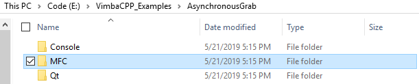
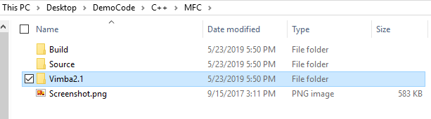
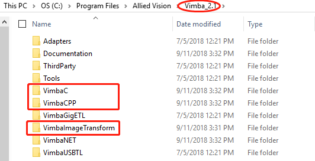
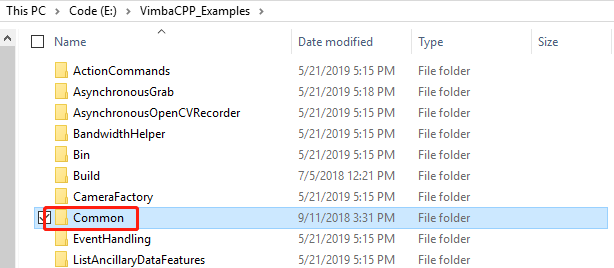
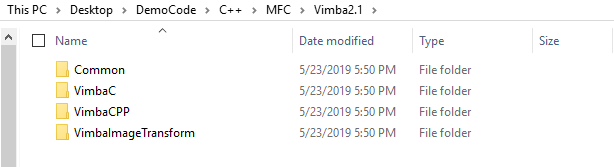
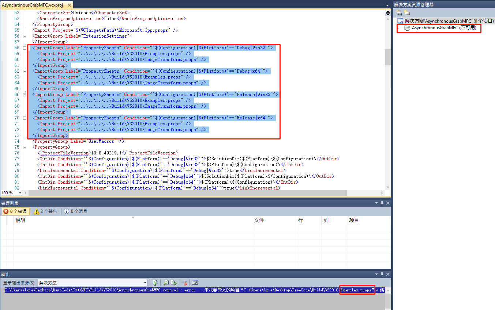
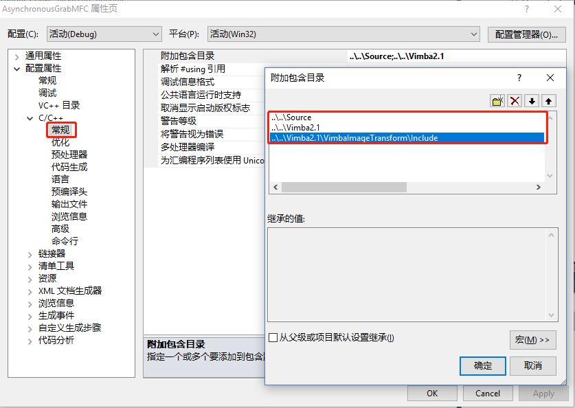
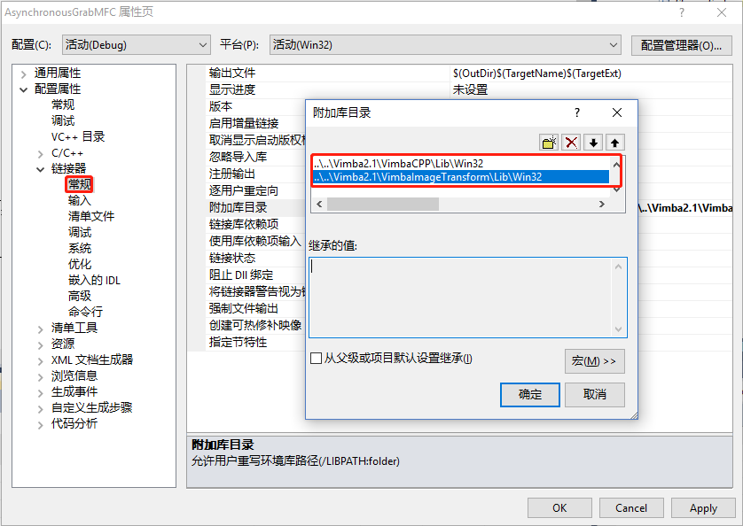
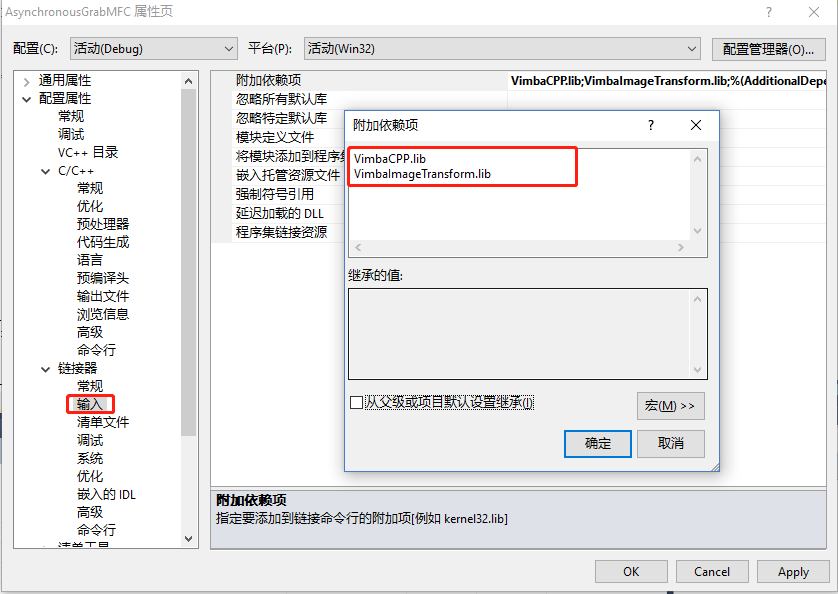
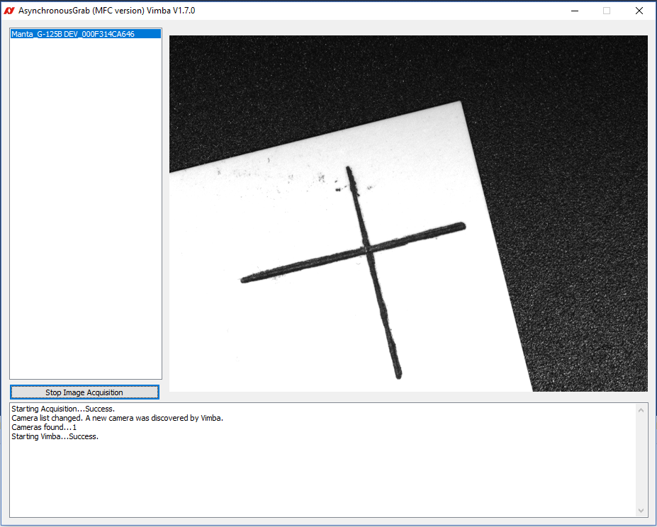

AVT相机官方例程移植
---

### 说明
相信不少开发人员为了节约时间，想直接在AVT相机的官方例程上做一些小修改，但是发现工程只有在Examples文件夹里才能正常工作，拷贝到磁盘另一个地方后，会导致无法打开解决方案或编译报错的问题，这样非常不利于程序的移植
本文档主要介绍如何直接在官方例程上修改，使之成为一个方便移植的程序。文档“MFC（VS2010）+ Vimba API编程实例”中介绍了调用Vimba API以及复用例程代码，和本文档会有部分重叠，感兴趣的小伙伴们可以参考如下链接：
https://github.com/avtcn/notes/blob/master/vimbasdk/VmbCPP/MFC_VmbAPI.md

## 1.	文件移动及资源整理
### 1.1 复制一个例子程序的文件夹到另一个磁盘，这里以异步采图的MFC程序文件夹为例
 
### 1.2 在拷贝出来的“MFC”文件夹内新建一个“Vimba2.1”文件夹

### 1.3 拷贝Vimba安装目录下的如下三个文件夹到新建的“Vimba2.1”文件夹

#### 启动后再停止，进行下一步
### 1.4	再将“Examples Folder”里的“Common”文件夹复制到新建的 “Vimba2.1”文件夹

## 2.	重新配置环境
### 2.1 打开解决方案
用VS2010打开解决方案时，会提示打不开文件，整个工程不可用

解决方式：删除“.vcxproj”文件里对应的行并保存，再打开工程文件已经可以了

### 2.2 重新设置“附加包含目录”

这里为了方便程序的移植，采用相对目录。相对目录的起点为“.vxcproj”文件所在的目录， 每个“..\”都会向上移动一个目录
### 2.3 重新设置“附加库目录”
这里以Win32程序为例， Win32程序在X64平台上也能运行，如果纯X64程序，则引用库目录改成Win64就可以了

### 2.4 设置“附加依赖项”

## 3.	上述工作完成后，启动并运行程序
结果如下图，已经可以正常采图了。复制程序到其它地方，也可以正常运行

代码链接：https://github.com/avtcn/notes/blob/master/vimbasdk/VmbCPP/MFC.zip

