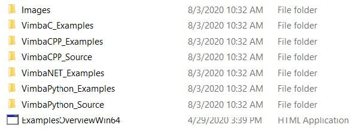

# ALVIUM USB3 系列相机快速使用说明

欢迎使用Allied Vision Technologies的产品，为方便您快速的使用我们的ALVIUM U系列工业相机，提供以下快速使用说明，本说明包含三个部分：

* 第一部分 ：安装Vimba
* 第二部分 ：Vimba Viewer 使用方法
* 第三部分 ：常见问题 Q&A


## 第一部分：安装Allied Vision SDK软件包Vimba

### 1.1 软件下载地址（免费下载安装，无需注册，目前版本是5.0）
>https://china.alliedvision.com/cn/support/software-downloads/
>  
(图1)
```
Vimba 是 Allied Vision GigE Vision, IEEE1394, USB3 Vision, 和 Camera Link 相机的专用软件。

Vimba 包含：
1. 在 Windows 系统下有最佳性能的驱动程序
2. 查看器应用程序可用于即时查看图像并在不编程的情况下探索相机功能
3. 用于多种像素格式输出的图像变换库
4. C, C++. NET, 和 Python 接口、样例和大量用户文档
```

### 1.2 根据您的操作系统环境，选择对应的软件版本下载（图2）
>  
(图2)

### 1.3 Vimba支持的相机种类和操作系统要求（图3）
>  
(图3)


### 1.4 在Windows环境下安装Vimba，双击下载的可执行文件，出现安装界面（图4）
>选择不同的安装模式，对于初次使用的用户，建议选择Application Development安装
Linux For X86/ARM的安装方式，采用自动化脚本，操作方法请参考软件附带的安装说明。 
>   
(图4)


### 1.5 安装完成后，请确保Install Vimba Drivers复选框打钩的前提下（图5），退出安装程序，此时会进行驱动程序的安装，驱动安装完成后即完成全部安装过程。
>  
(图5)


## 第二部分：Vimba Viewer的使用方法
介绍一下相机调试工具Vimba Viewer, 双击图标启动软件（图6）
>  
(图6)


### 2.1 在画面左侧的相机列表中，会出现当前连接的相机，我们连接USB3.0相机时，相机的型号会出现在USB总线下，此时单击相机的名称即可进入调试界面（图7）
>   
(图7)


### 2.2 调试界面如下图所示，与一般的Windows软件类似，界面包含菜单栏，工具栏，显示区域和参数设置区域
>   
(图8)

### 2.3 工具栏上的工具按钮依次为：①开始/停止采集 ②保存图像 ③读取配置到相机 ④保存配置到主机 ⑤打开直方图窗口 ⑥画面填充整个界面 ⑦画面向左旋转90° ⑧画面向右旋转90° ⑨放大图像，默认比例 ，缩小图像 ⑩调出Docking窗口
>    
(图9)


### 2.4【参数区-亮度相关】控制图像的亮度值，包括以下主要参数：
>Exposure【曝光值】，单位微秒；  
Exposure Auto【自动曝光】，可以选择关闭，单次和连续三种模式；  
Gain【增益】，单位db;  
Gain Auto【自动增益】，可以选择关闭，单次和连续三种模式；  
Intensity Controller Target【亮度控制目标值】：使用自动功能时设置的目标值；  
Black Level【黑底】：调整相机的底噪；  
Gamma【Gamma】：调整图像的Gamma值；  
   
(图10)

### 2.5【参数区-ROI相关】控制图像的有效区域，包括以下主要参数：
>Pixel Format【像素格式】：选择输出的像素格式，需要在停止采集状态下修改；  
ROI【有效区域】：更改相机输出的有效区域大小和位置，需要在停止采集状态下修改；  
     
(图11)

### 2.6【参数区-自动功能ROI】：指定自动曝光、自动增益等自动功能的有效区域，需要在停止采集状态下修改；
>   
(图12)


### 2.7【参数区-触发&I/O】
>Trigger Source【触发源】：选择触发相机的方式为软触发或者外部触发；  
Trigger Actv.【有效沿】：选择外触发信号的有效边沿；  
Trigger Selector【触发选择】：选择触发信号的作用点；  
Trigger Mode【模式】：打开或者关闭触发功能；  
Acquisiton Mode【采集模式】：选择单帧、多帧、连续三种不同的采集方式；  
Exp. Mode【曝光模式】：定时曝光；   
    
(图13)


### 2.8【参数区-全部参数】：包含了相机的全部参数，按照参数所属功能分类，可通过过滤器进行关键字搜索快速定位；
>  
(图14)

### 2.9【状态栏】显示当前的采集状态，图像高度，宽度，像素格式，累计采集的帧数，当前的Rec帧率，Cam帧率，Dis帧率
> Rec帧率表示SDK收到的帧率  
Cam 帧率表示相机发出的帧率  
Dis 帧率表示显示帧率，最大30fps左右   
 
(图15)


### 2.10 常用的相机工作模式设置方法：

#### 2.10.1 【设置连续自由采集】：
>【Trigger Source】选择为Software  
【Trigger Mode】 选择为Off  
【Trigger Selector】 选择为FrameStart  
【Acquisiton Mode】 选择为Continuous  
单击工具栏上的开始采集，相机将开始连续的自由采集  

#### 2.10.2 【设置软件触发采集】：
>【Trigger Source】选择为Software  
【Trigger Mode】 选择为On  
【Trigger Selector】 选择为FrameStart  
【Acquisiton Mode】 选择为Continuous  
单击工具栏上的开始采集  
单击SW Trigger按钮一次，相机将采集一次  

#### 2.10.3 【设置硬件触发采集】：
>【Trigger Source】选择为Line0  
【Actvx.】 选择为需要的有效边沿类型  
【Trigger Mode】 选择为On  
【Trigger Selector】 选择为FrameStart  
【Acquisiton Mode】 选择为Continuous  
单击工具栏上的开始采集  
Line0有效激活一次，相机将采集一次  


## 第三部分:常见问题Q&A

### Q1. 相机无法采集图像，或者采集帧率很低？
>A1. 首先检查相机的连接是否正常，相机尾部绿色指示灯是否点亮；其次，确认连接的USB接口是否是USB3.0接口，可以通过VimbaViewer的Device Link Speed是否为450000000来确认，如果此时连接的接口为USB2.0或者发生硬件故障，这里的值为50000000；


### Q2. 相机连续采集时无法达到最高的帧率？
>A2. 相机默认的带宽设置是200000000(200MB)，对于分辨率较高的相机，需要提高带宽才能达到最大帧帧率，可以通过设置Device Link Throughput Limit （图16）来修改带宽，最大值可以改为450000000(450MB)；  
为了达到最大采集帧速，建议根据电脑的性能设置此参数为 400000000 或者 420000000。  
   
(图16)


### Q3. 如何保存拍摄的图像？
>A3. 对于单张图像，可以在采集停止时，鼠标右键点击显示区，调出Save Image…对话框进行保存；
对于保存多张图像，需要在采集前指定保存的张数，保存地址，命名规则等信息，以上信息可以在菜单栏File中的Image Serial Option里设置，设置完成后开始采集，当采集的帧数超过设置的保存张数时，停止采集，点击工具栏上的Save Images按钮即可完成批量保存； 
   
(图17)


### Q4. 我设置好了参数，相机掉电后无法保存怎么办？
>A4. 相机支持两种方式保存参数，一种是通过相机片上的闪存保存，另外一种是通过读入xml文件来进行参数保存；由于目前的固件还未支持相机片上保存，所以我们可以采用读写xml文件的方式来保存参数，预计11月份的新固件即可支持相机片上保存；
保存和读取xml文件的方法很简单，在工具栏上单击对应的Load和Save按钮即可。 
另外可以参考文档：[修改并保存相机参数](../../Normal_Issue/SaveUserset/Save_Userset.md)  
   
(图18)


### Q5. 我想通过SDK对相机进行开发，如何获得例程和文档？
>A5. VIMBA安装时，会自动安装开发环境及开发文档到主机，请通过Windows的开始菜单，找到Allied Vision Vimba文件夹，在此文件夹下，针对不同的语言，有对应的开发API手册：
《Vimba C API Manuual》 《Vimba C++ API Mannual》 《Vimba C# API Mannual》《Vimba Python API Mannual》
例子请参考Vimba Examples Folder, 同样按照不同的语言，进行了分类（图19）；
   
(图19)


### Q6. Linux ARM/Intel 平台下 Alvium USB3 相机的性能优化方法有哪些？
>A6. 详细方法请参考 [Optimizing-Performance-Jetson_appnote_v2.0.0.pdf](Optimizing-Performance-Jetson_appnote_v2.0.0.pdf)  
几个重要修改点如下：  
* `sudo sh -c 'echo 1000 > /sys/module/usbcore/parameters/usbfs_memory_mb'`，也可以参考[解决Linux / Ubuntu使用USB工业相机卡顿、帧率不够的问题](https://blog.csdn.net/a435262767/article/details/103503559)  
* `DeviceLinkThroughputLimit -> 400000000`, 最大到可达450000000
* 在 `Vimba_4_1/VimbaUSBTL/CTI/x86_64bit/VimbaUSBTL.xml` 文件中，修改`MaxTransferSize`(取消注释即可)


### Q7. 本手册的PDF版本在哪里下载？
>A7. 请点击链接 [ALVIUM_Manual_AVTCN.pdf](ALVIUM_Manual_AVTCN.pdf)


---

## Version
2021/01/26
