# Allied Vision / AVT 千兆网GigE 相机快速使用说明

欢迎使用Allied Vision Technologies的产品，为方便您快速的使用我们的GigE千兆网系列工业相机，提供以下快速使用说明，本说明包含三个部分：

* 第一部分 ：安装相机软件开发包Vimba SDK
* 第二部分 ：Vimba Viewer 使用方法
* 第三部分 ：千兆网相机性能优化方法
* 第四部分 ：常见问题 Q&A

  

## 第一部分：安装Allied Vision SDK软件包 - Vimba SDK

### 1.1 软件下载地址（免费下载安装，无需注册，目前版本是`Vimba 5.0`）
>https://china.alliedvision.com/cn/support/software-downloads/
>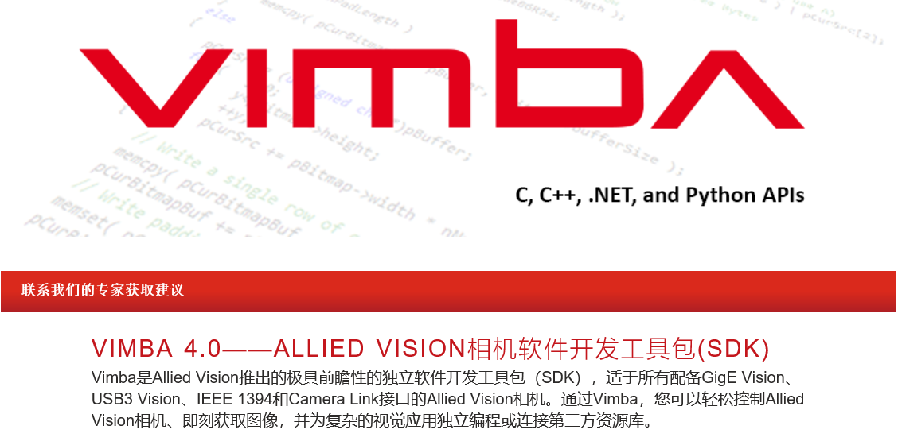  
(图1)

Vimba 是 Allied Vision GigE Vision, IEEE1394, USB3 Vision, 和 Camera Link 相机的专用软件。

Vimba 包含：
1. 在 Windows 系统下有最佳性能的驱动程序
2. 查看器应用程序可用于即时查看图像并在不编程的情况下探索相机功能
3. 用于多种像素格式输出的图像变换库
4. C, C++. NET, 和 Python 接口、样例和大量用户文档

### 1.2 根据您的操作系统环境，选择对应的软件版本下载（图2）
>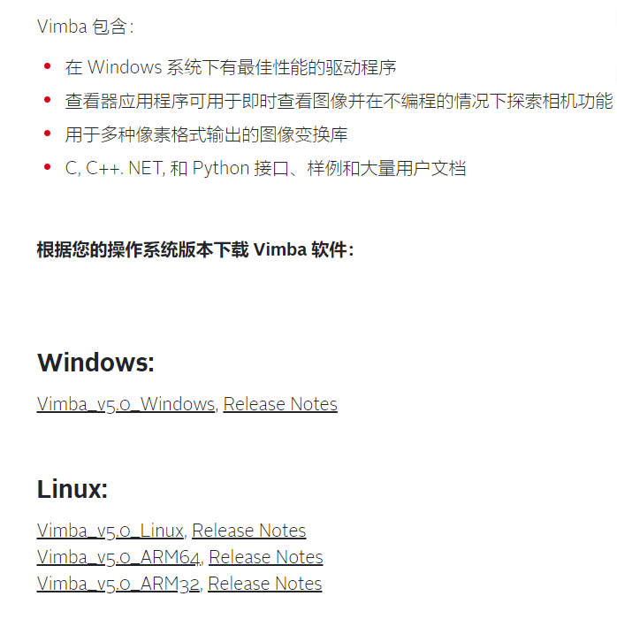  
(图2)

### 1.3 Vimba支持的相机种类和操作系统要求（图3）
>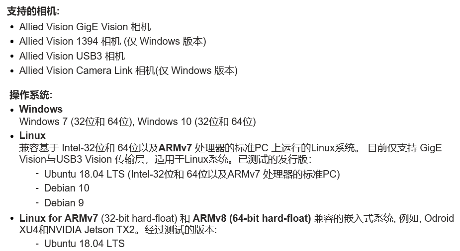  
(图3)

### 1.4 在Windows环境下安装Vimba，双击下载的可执行文件，出现安装界面（图4）
>选择不同的安装模式，对于初次使用的用户，建议选择 `Application Development` 安装
Linux For X86/ARM的安装方式，采用自动化脚本，操作方法请参考软件附带的安装说明。   
***一定要选择 `Application Development` 模式，否则API 文档及 代码例程 不会安装。***
***另外，请确保当前安装用户有管理员权限。***
>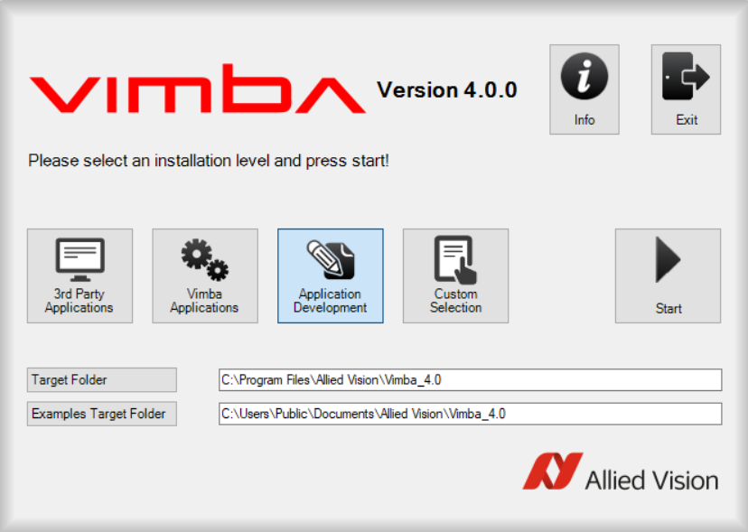   
(图4)

### 1.5 安装完成后，请确保Install Vimba Drivers复选框打钩的前提下（图5），退出安装程序，此时会进行驱动程序的安装，驱动安装完成后即完成全部安装过程。
>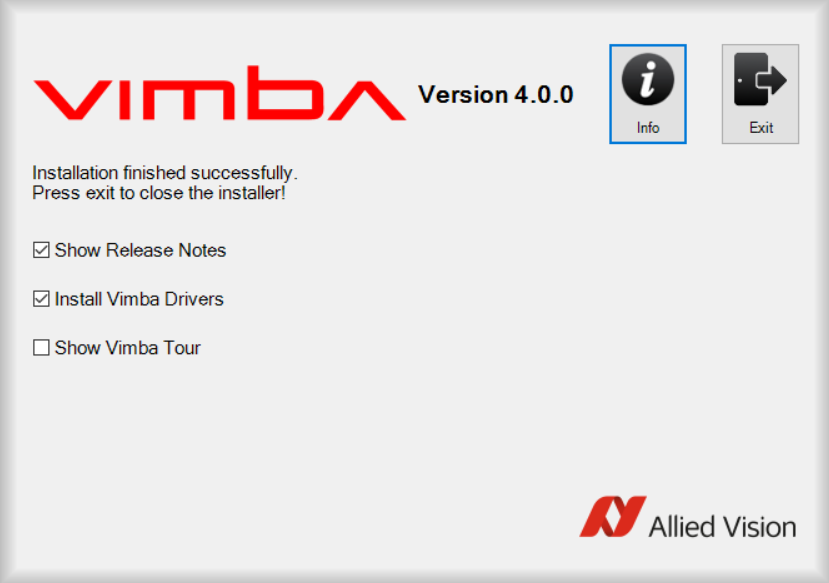  
(图5)  
***驱动安装过程中会提示信任驱动安装，请选择信任。 ***

### 1.6 GigE驱动安装
打开桌面的`Vimba Driver Installer`程序，并将AVT相机驱动（GigE/USB3）都设置成Vimba 5.0或者类似最新版本：
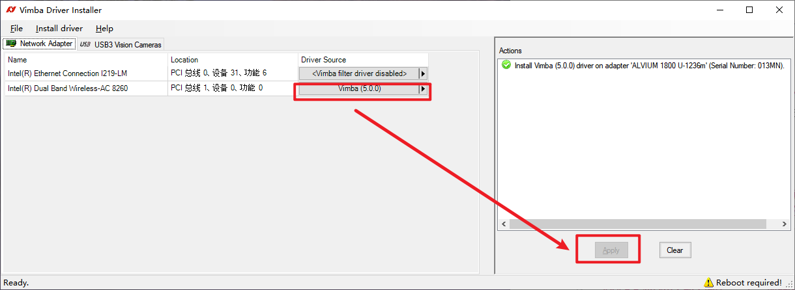

### 1.7 Win7 64bit电脑系统需要打补丁
请安装`Windows6.1-KB3033929-x64-win7 patch.msu`，以关键字`KB3033929`在网络找到它，并安装。

---

## 第二部分：Vimba Viewer的使用方法
介绍一下相机调试工具Vimba Viewer, 双击图标启动软件（图6）
>  
(图6)

### 2.1 在画面左侧的相机列表中，会出现当前连接的相机，我们连接USB3.0相机时，相机的型号会出现在USB总线下，此时单击相机的名称即可进入调试界面（图7）
>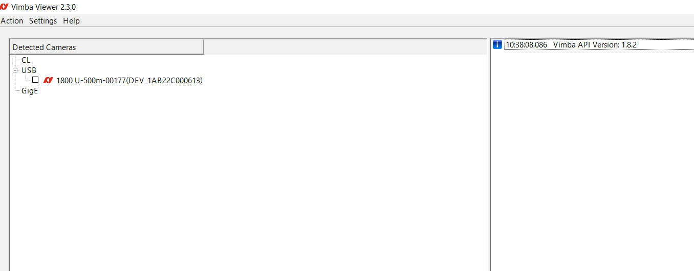   
(图7)

### 2.2 调试界面如下图所示，与一般的Windows软件类似，界面包含菜单栏，工具栏，显示区域和参数设置区域
>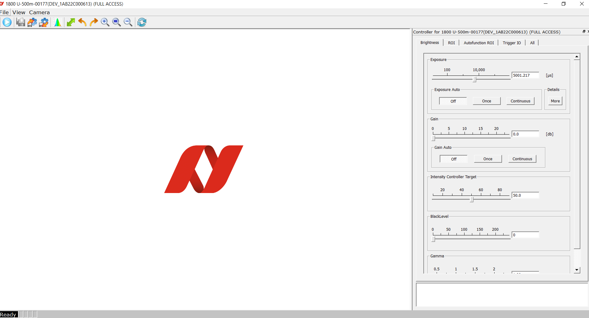   
(图8)

### 2.3 工具栏上的工具按钮依次为：①开始/停止采集 ②保存图像 ③读取配置到相机 ④保存配置到主机 ⑤打开直方图窗口 ⑥画面填充整个界面 ⑦画面向左旋转90° ⑧画面向右旋转90° ⑨放大图像，默认比例 ，缩小图像 ⑩调出Docking窗口
> 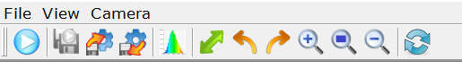   
(图9)

### 2.4【参数区-亮度相关】控制图像的亮度值，包括以下主要参数：
>Exposure【曝光值】，单位微秒；  
Exposure Auto【自动曝光】，可以选择关闭，单次和连续三种模式；  
Gain【增益】，单位db;  
Gain Auto【自动增益】，可以选择关闭，单次和连续三种模式；  
Intensity Controller Target【亮度控制目标值】：使用自动功能时设置的目标值；  
Black Level【黑底】：调整相机的底噪；  
Gamma【Gamma】：调整图像的Gamma值；  
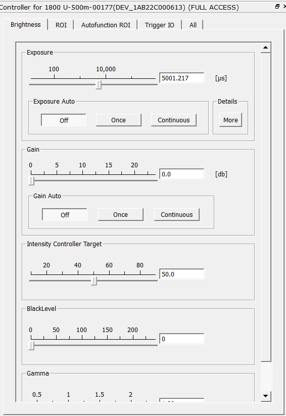   
(图10)

### 2.5【参数区-ROI相关】控制图像的有效区域，包括以下主要参数：
>Pixel Format【像素格式】：选择输出的像素格式，需要在停止采集状态下修改；  
ROI【有效区域】：更改相机输出的有效区域大小和位置，需要在停止采集状态下修改；  
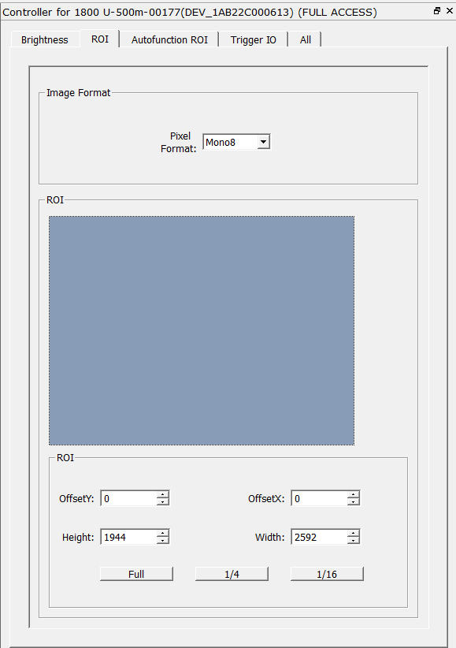     
(图11)

### 2.6【参数区-自动功能ROI】：指定自动曝光、自动增益等自动功能的有效区域，需要在停止采集状态下修改；
>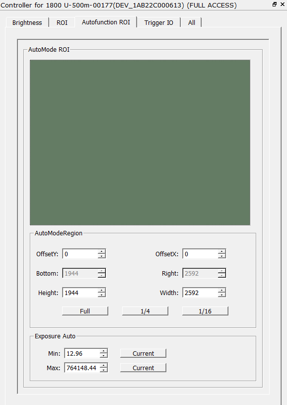   
(图12)

### 2.7【参数区-触发&I/O】
>Trigger Source【触发源】：选择触发相机的方式为软触发或者外部触发；  
Trigger Actv.【有效沿】：选择外触发信号的有效边沿；  
Trigger Selector【触发选择】：选择触发信号的作用点；  
Trigger Mode【模式】：打开或者关闭触发功能；  
Acquisiton Mode【采集模式】：选择单帧、多帧、连续三种不同的采集方式；  
Exp. Mode【曝光模式】：定时曝光；   
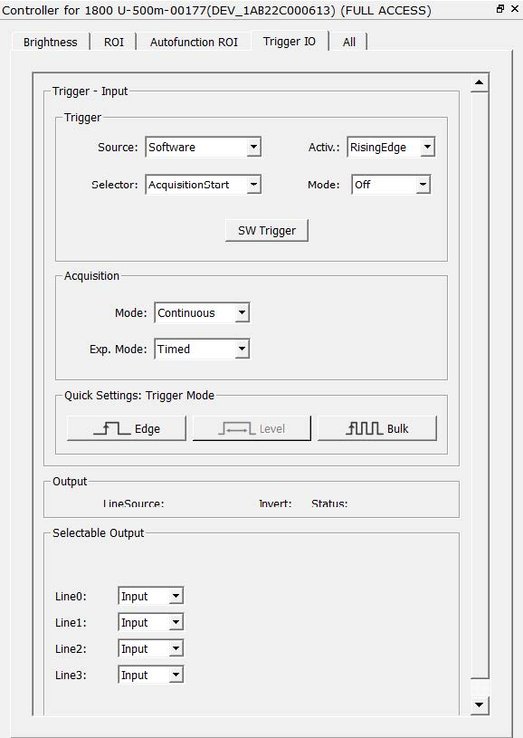    
(图13)

### 2.8【参数区-全部参数】：包含了相机的全部参数，按照参数所属功能分类，可通过过滤器进行关键字搜索快速定位；
>  
(图14)

### 2.9【状态栏】显示当前的采集状态，图像高度，宽度，像素格式，累计采集的帧数，当前的Rec帧率，Cam帧率，Dis帧率
> Rec帧率表示SDK收到的帧率  
Cam 帧率表示相机发出的帧率  
Dis 帧率表示显示帧率，最大30fps左右   
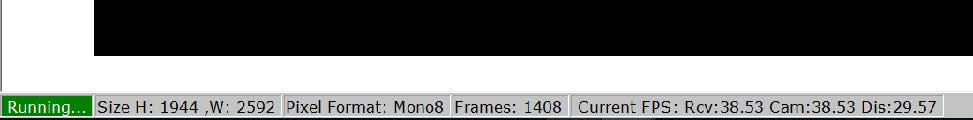 
(图15)

### 2.10 常用的相机工作模式设置方法：

#### 2.10.1 【设置连续自由采集】：
>【Trigger Source】选择为Software  
【Trigger Mode】 选择为Off  
【Trigger Selector】 选择为FrameStart  
【Acquisiton Mode】 选择为Continuous  
单击工具栏上的开始采集，相机将开始连续的自由采集  

#### 2.10.2 【设置软件触发采集】：
>【Trigger Source】选择为Software  
【Trigger Mode】 选择为On  
【Trigger Selector】 选择为FrameStart  
【Acquisiton Mode】 选择为Continuous  
单击工具栏上的开始采集  
单击SW Trigger按钮一次，相机将采集一次  

#### 2.10.3 【设置硬件触发采集】：
>【Trigger Source】选择为Line0  
【Actvx.】 选择为需要的有效边沿类型  
【Trigger Mode】 选择为On  
【Trigger Selector】 选择为FrameStart  
【Acquisiton Mode】 选择为Continuous  
单击工具栏上的开始采集  
Line0有效激活一次，相机将采集一次  

---

##  第三部分：千兆网相机性能优化方法

### 3.1 千兆网相机硬件连接

#### 3.1.1 千兆网卡 - GigE PCIe 数据采集卡
为确保工业相机传输的可靠性和带宽，GigE接口的工业相机请连接到千兆网卡或者千兆网交换机上，我司推荐网卡及交换机型号如下:  
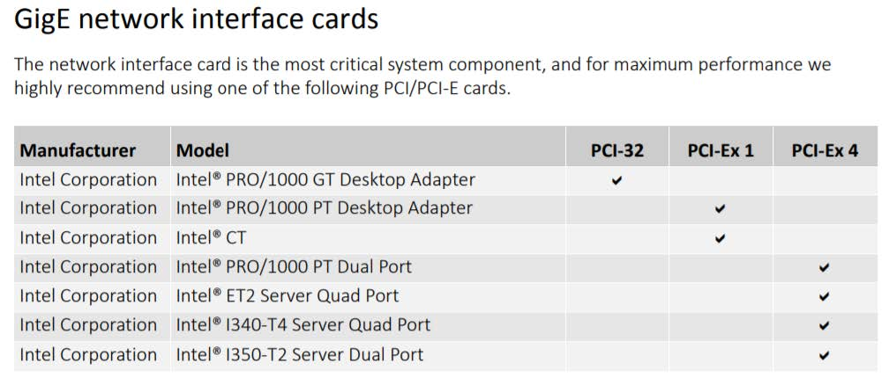  

例如：下图为一款带4个千兆网接口的网卡，可以接入4台AVT千兆网相机：
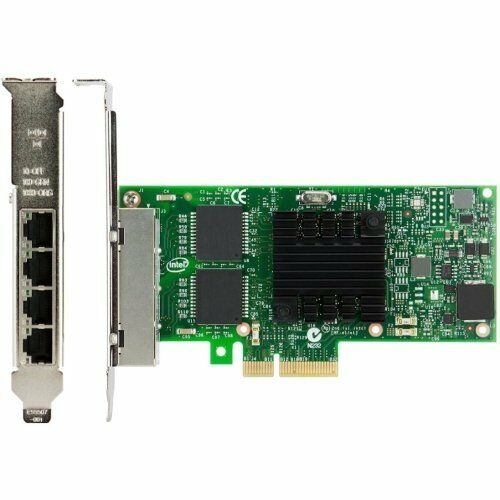

#### 3.1.2 千兆交换机 - GigE Switch 交换机
也可以使用千兆网交换机接入多台相机，但是由于共享带宽的原因，每台相机的实际使用带宽会变小：
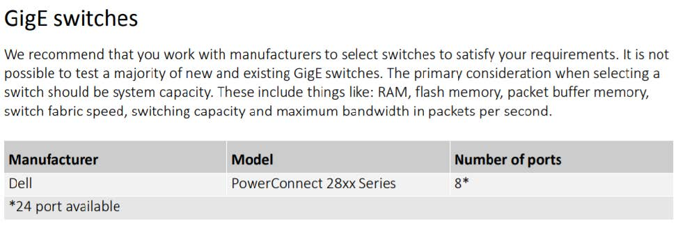  

下图为8口千兆交换机，其中4个为PoE接口，可以给支持PoE功能的相机供电：
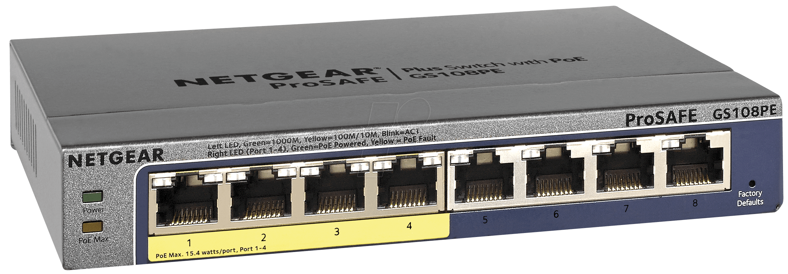

***当多个相机通过千兆交换机，连接到一个网口时，多相机共享一个千兆网带宽，需要对每个相机的传输带宽做限制，确保不会发生数据冲突现象***

#### 3.1.3 相机供电电源配件
电源连接，Mako系列的电源接口为8PIN接头，Manta和GT系列的电源接口为12PIN 接头，请根据相机型号选择对应的电源；对于支持PoE的型号，可以不需要电源，通过网线给相机供电，我司推荐PoE网卡及PoE交换机型号如下（图7）:
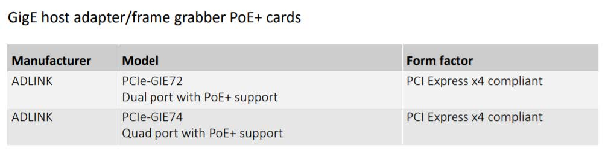
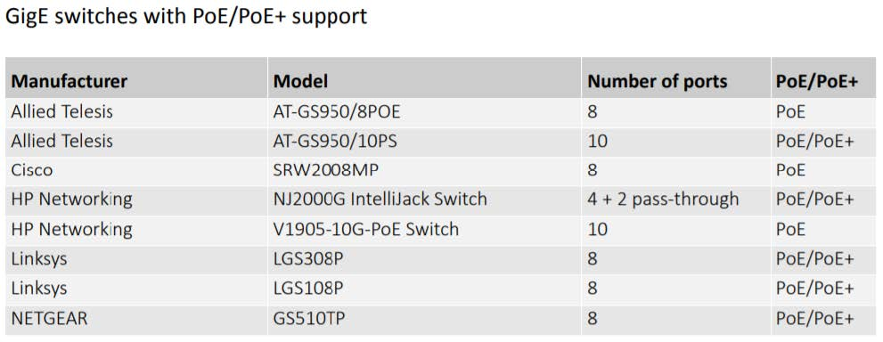

***PoE模式下，需要连接的网卡也具有相应的PoE功能，或者使用PoE Injector的方式***

### 3.2 Vimba Driver Installer 使用 - 安装千兆网卡的AVT Vimba驱动
可以使用Vimba Driver Installer 程序对相机连接的网卡驱动进行优化，以达到最高的数据传输效率，同时减少CPU占用率：
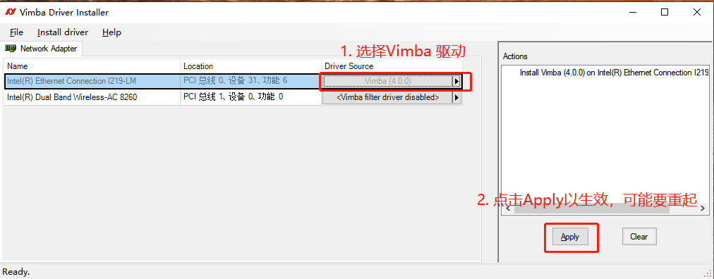

#### 3.2.1 网卡驱动参数优化
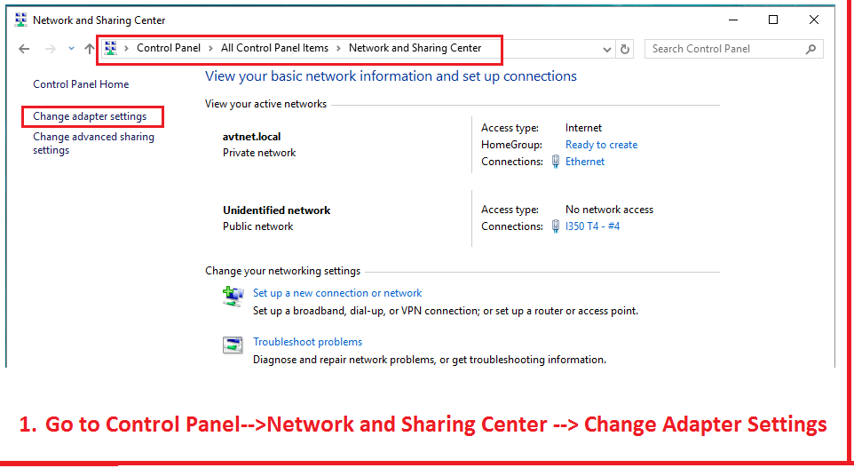
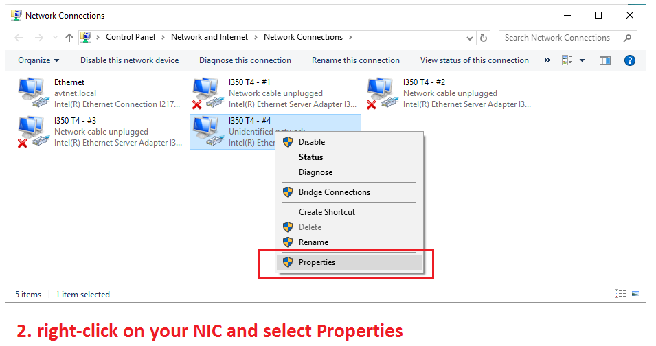
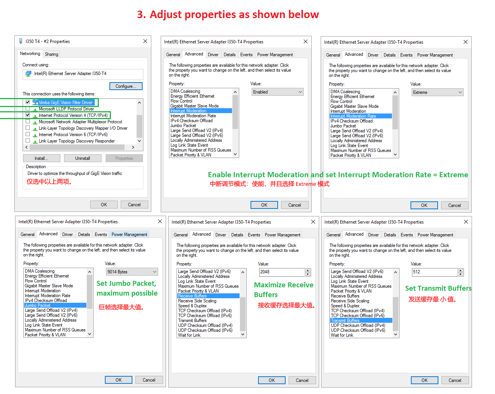

### 3.3 网卡及相机的IP设置
可以使用Vimba Viewer的Open Config菜单进行相机IP修改：
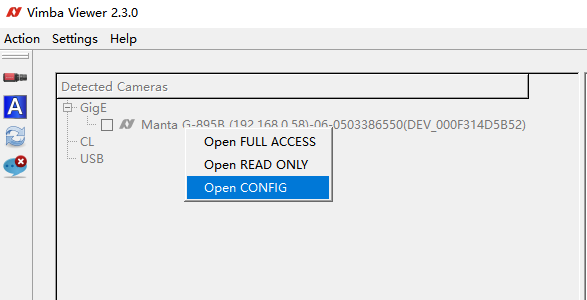

#### 3.3.1 DHCP 动态IP模式
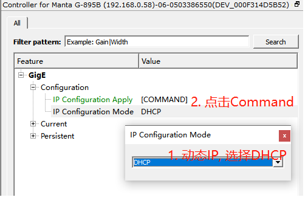

#### 3.3.2 Persistent 固定IP模式
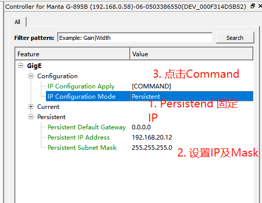

### 3.4 网卡驱动性能优化
下面每张图片选中部分的参数是需要优化的条目：
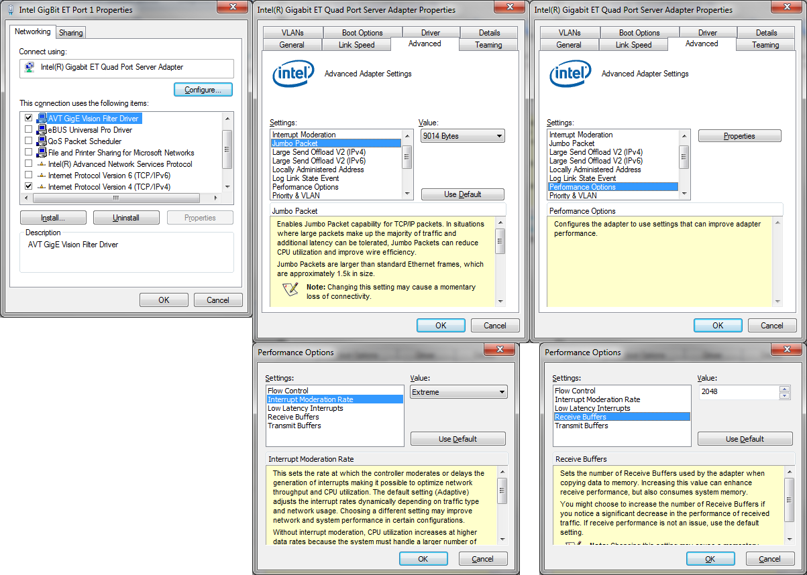

### 3.5 网络性能测试
可以使用Vimba Viewer中Statistics部分查看是否有大量的丢帧/重传等错误:
1. GVSP Packet Size: 最好是8999，也就是之前网卡驱动中的Jumbo Packet Size 巨帧参数。
2. Statistics: Stat Frames Dropped/Rescued/Shoved/Underrun， Stat Packets Errors/Missed/Requested/Resent 等变化越小越好。这些值最开始都是0，在经过几分钟，几个小时后，这些值如果变化很小，例如小于100，那么代表网络传输效率很好，反之，如果每秒增加几或者几十的数值，那么代表网络效率很差，需要找到原因并优化。  
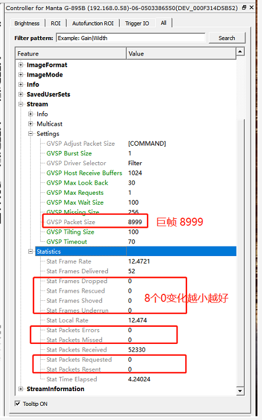

---

## 第三部分：常见问题Q&A

### Q1. 如何保存当前参数和配置到相机，重新掉电后自动加载？
>A1. 相机本身可以保存4组用户设置：Default,UserSet1,UserSet2,UserSet3,其中Default为出厂默认配置，如果用户需要保存自己参数，请先指定Default以外的设置，比如UserSet1，点击UserSetSave[COMMAND]完成参数的保存，在UserSetDaultSelector中选中UserSet1,作为相机上电后自动运行的设置组即可。
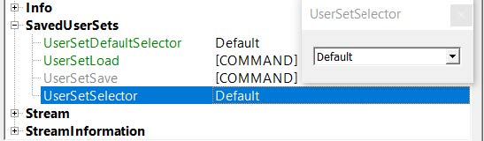
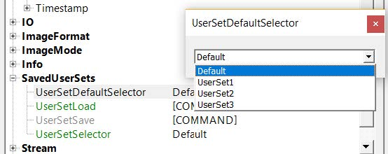

### Q2. 相机无法采集图像，或者采集帧率很低？
>A2. 确认是否正在使用千兆网模式，避免误用百兆网。另外彩色相机的RGB8会让帧速减小为1/3，可以使用BayerRGB8代替，以达到标称最高帧带。
相机默认的带宽设置是115000000，对于千兆网接口来说，此带宽最大可以设置为125000000，通过修改此参数，可以让相机达到最大帧率采集。  

### Q3. 如何保存拍摄的图像？
>A3. 对于单张图像，可以在采集停止时，鼠标右键点击显示区，调出Save Image…对话框进行保存；
对于保存多张图像，需要在采集前指定保存的张数，保存地址，命名规则等信息，以上信息可以在菜单栏File中的Image Serial Option里设置，设置完成后开始采集，当采集的帧数超过设置的保存张数时，停止采集，点击工具栏上的Save Images按钮即可完成批量保存； 
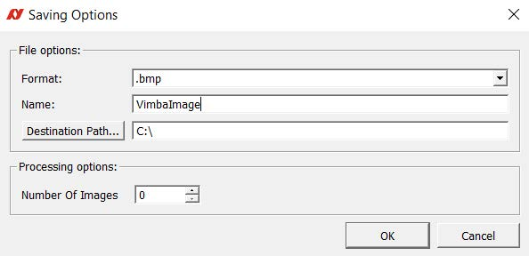   
(图17)

### Q4. 我想通过SDK对相机进行开发，如何获得例程和文档？
>A4. VIMBA安装时，会自动安装开发环境及开发文档到主机，请通过Windows的开始菜单，找到Allied Vision Vimba文件夹，在此文件夹下，针对不同的语言，有对应的开发API手册：
《Vimba C API Manuual》 《Vimba C++ API Mannual》 《Vimba C# API Mannual》《Vimba Python API Mannual》
例子请参考Vimba Examples Folder, 同样按照不同的语言，进行了分类（图19）；
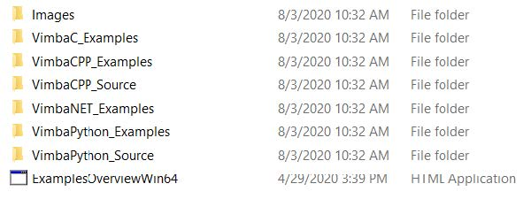   
(图19)

### Q6. Linux 平台下 AVT 千兆网相机的性能优化方法有哪些？
>A6. 详细方法请参考 [Vimba-Installation-under-Linux-Application-Note_V2.3.0.pdf](Vimba-Installation-under-Linux-Application-Note_V2.3.0.pdf) 
以及 libpng 库安装方法：  
[vimba-linux-libpng-installation.pdf](vimba-linux-libpng-installation.pdf)

### Q7. 如何将相机采集的图片保存到视频文件?
>A7. 参考：AsynchronousOpenCVRecorder 例程，基于QT + OpenCV 3.0 + Vimba/PvAPI  
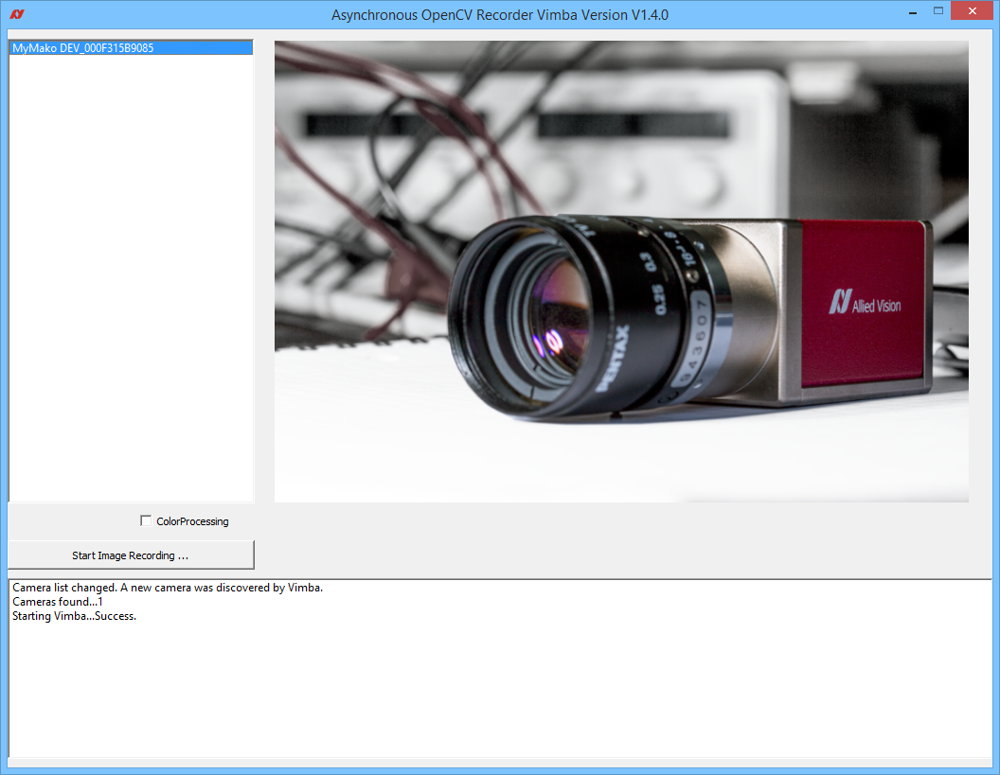

### Q8. 本手册的PDF版本在哪里下载?
>A8. 请点击链接 [AVT_GigE_Manual_AVTCN.pdf](AVT_GigE_Manual_AVTCN.pdf)

---

## Version
2021/04/30

