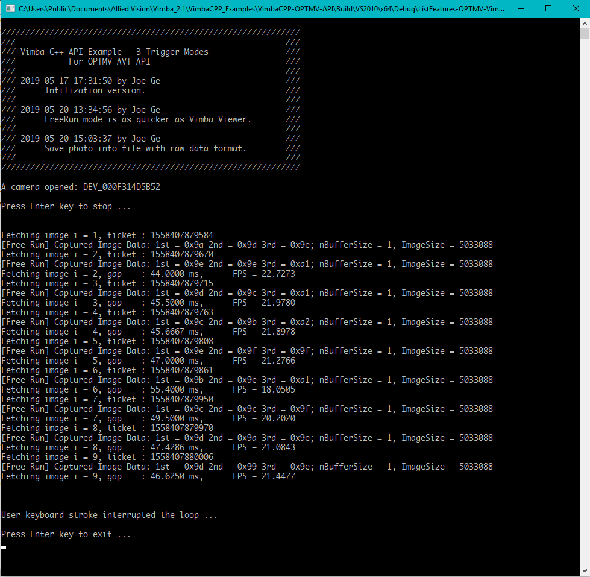

Vimba C++ API 三种触发模式编程接口 API Console - OpenCamera/StartAcquire/Shot/StopAquire/CloseCamera
---

## 简介
基于Allied Vision Vimba C++ SDK实现如下简要相机操作接口：

```CPP
class SciCamera
{
public: // AVT Camera Manipulate API
	SciCamera();
	~SciCamera(); 

	VmbErrorType GetCameraList(CameraPtrVector &rCameras);

	VmbErrorType OpenCamera(const char * strCameraID);
	VmbErrorType CloseCamera(); 

	long StartAcquire(int mode = 1);
	long StopAcquire();

	long Shot(std::vector<VmbUchar_t> & photo, int msTimeout = 5000);

public: // Joe Ge added
	VmbErrorType GetCameraID(std::string &rStrID);

private:
	CameraPtr m_pCamera;
	int       m_nCameraMode;

	VimbaSystem& sys; 
	FrameObserver*      m_pFrameObserver;           // Every camera has its own frame observer

	bool SetInternalMode(int mode); 
	bool TriggerSoftwareSignal(); 
	long WaitForNextImageReady(int ms);

	std::vector<VmbUchar_t> GetImage(); 
	std::vector<VmbUchar_t> GetImage(int & nBufferSize); 
}; 
```

此SciCamera实现了一个AVT相机类，并实现如下接口：
1. `OpenCamera()` - 打开相机
2. `StartAcquire()` - 开始相机采集模式
3. `Shot()` - 拍照，此步骤可以一直连续使用下去（支持三种拍照模式：软件触发，硬件触发，自由采集）
4. `StopAcquire()` - 停止相机采集模式 
5. `CloseCamera()` - 打开相机

## 应用方法

```CPP
int main( int argc, char* argv[] )
{
    std::cout << "\n";
    std::cout << "//////////////////////////////////////////////////////////////\n";
    std::cout << "/// Vimba C++ API Example - 3 Trigger Modes                ///\n";
    std::cout << "/// 2019-05-17 17:31:50 by Joe Ge                          ///\n";
    std::cout << "///      Intilization version.                             ///\n";
    std::cout << "/// 2019-05-20 13:34:56 by Joe Ge                          ///\n";
    std::cout << "///      FreeRun mode is as quicker as Vimba Viewer.       ///\n";
    std::cout << "/// 2019-05-20 15:03:37 by Joe Ge                          ///\n";
    std::cout << "///      Save photo into file with raw data format.        ///\n";
    std::cout << "//////////////////////////////////////////////////////////////\n\n";

	// FPS calculation
	std::queue<long long> queueTickets;

	// Single Vimba SDK Instance
	VimbaSystem& sys = VimbaSystem::GetInstance();           // Get a reference to the VimbaSystem singleton
	sys.Startup();

	SciCamera camera; 
	CameraPtrVector cameras;

	// Open a camera
	std::string strCameraID;
	sys.GetCameras(cameras);
	if (!cameras.empty())
	{
		cameras[0]->GetID(strCameraID);
		camera.OpenCamera(strCameraID.c_str());
	}

	std::string strOpenedCameraName;
	camera.GetCameraID(strOpenedCameraName);
	std::cout << "A camera opened: " << strOpenedCameraName.c_str() << std::endl;

	// Start image acquisition with one of following modes
	//  1. Software trigger  
	//  2. Hardware trigger  
	//  3. Free Run trigger 
	camera.StartAcquire(3); 

	// Capture Images in one of three modes: SW/HW/Free
	int i = 0;
	while (i++ < 20000)
	{
		std::cout << "Fetching image i = " << i << ", ticket : " << tickets() << std::endl;
		std::vector<VmbUchar_t> imageRaw;

		// Take one photo !!! 
		camera.Shot(imageRaw);

		// Save raw data of image
		// Use ImageJ or similar tool to view
		// ... 
		// FPS calculation, print image sequence information
		// ... 
	}

	// -------------------------- stop camera and quit -------------------------------------- //
	// Following steps only to be applied when the system wants to exit.

	// Stop image acquisition
	camera.StopAcquire();

	// Close a camera
	camera.CloseCamera();

	// Clean Vimba SDK Resource before exiting
	sys.Shutdown(); 
}
```
上述代码使用SciCamera类打开一个AVT相机，并选择如下任一种采集模式进行图像采集：
* Software trigger  
* Hardware trigger  
* Free Run trigger 

可以调用函数`camera.StartAcquire(mode)`进行相机模式设置。


## 代码
此例子代码下载： 


运行结果如下，可以通过回车键进行中止：



## 修改历史
1. 2019-05-21 11:58:14 Joe Ge(joe.ge@alliedvision.com) 初始版本Manta G895B测试通过。


## 联系方式
可以通过AVT技术邮箱：support@alliedvision.com 联系我们。
