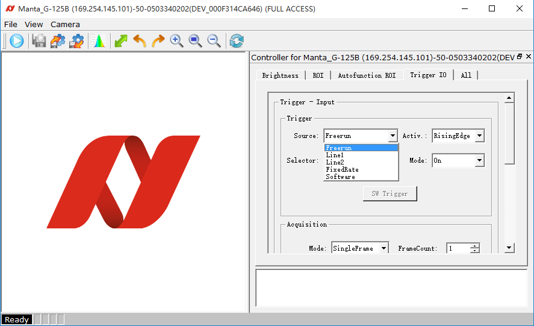
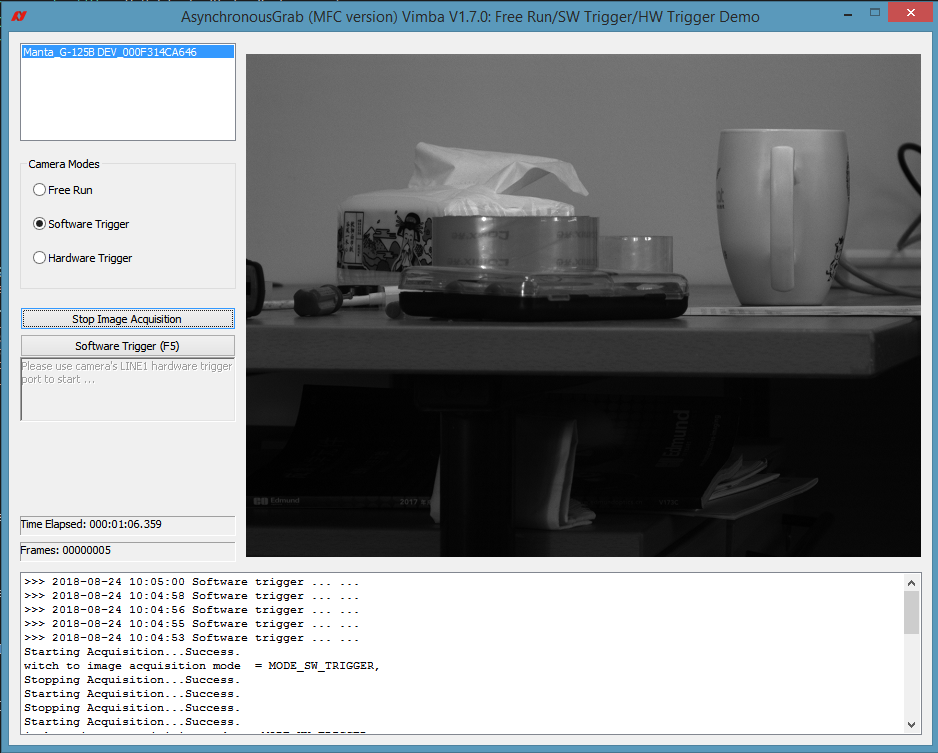

Vimba C++ API 三种拍照模式编程实例 - MFC GUI
---

```
TODO: 增加fps显示，或者软件触发时一张图片的采集时间。
```

Allied Vision工业相机一般可以使用三种模式进行拍照:
1. 自由采集(Free Run)
2. 软件触发拍照(Software Trigger)
3. 硬件触发拍照(Hardware Trigger)


 
上图中是Vimba Viewer中显示的一款相机支持的拍照模式：
* Freerun - 自由采集
* Line1 - 硬件触发1
* Line2 - 硬件触发2
* FixedRate - 固定帧率(自由采集)
* Software - 软件触发拍照  

其中FixedRate是Freerun的一种特殊模式-以确定的频率进行拍照，例如1fps代表一秒拍摄一张等； Line1和Line2表示相机有两根触发线，用户可以任选
其一来接外部触发信息源进行图像拍摄；Software模式是指相机处理待命状态，当通过以太网（例如GigE千兆网相机）连接相机时，可以通过 Vimba SDK的
相应API向相机发出拍照指令，然后获得一张相应的照片。


## Vimba C++ API 实例 - 三种拍照模式编程方法
以下是基于Allied Vision Vimba SDK 2.1.3 C++ API 进行相机拍摄模式编程的例子。

 


## 例子代码
请访问：https://github.com/avtcn/notes/blob/master/vimbasdk/vimba-cpp-3-programming-modes/AsynchronousGrab-OPTMV-SW-HW-Trigger.zip   

或者直接使用下面链接下载：  
[AsynchronousGrab-OPTMV-SW-HW-Trigger.zip](AsynchronousGrab-OPTMV-SW-HW-Trigger.zip?raw=true)


## 需要软件
* Visual Studio Community 2017 (http://www.visualstudio.com/) 或者类似版本
* Vimba SDK 2.1.3 (https://www.alliedvision.com/en/products/software.html) 或者类似版本

## 使用方法

## 修改提示


## 其它信息
联系 support@alliedvision.com 获取更多帮助。

2018-11-23 14:55:29
by Joe Ge

