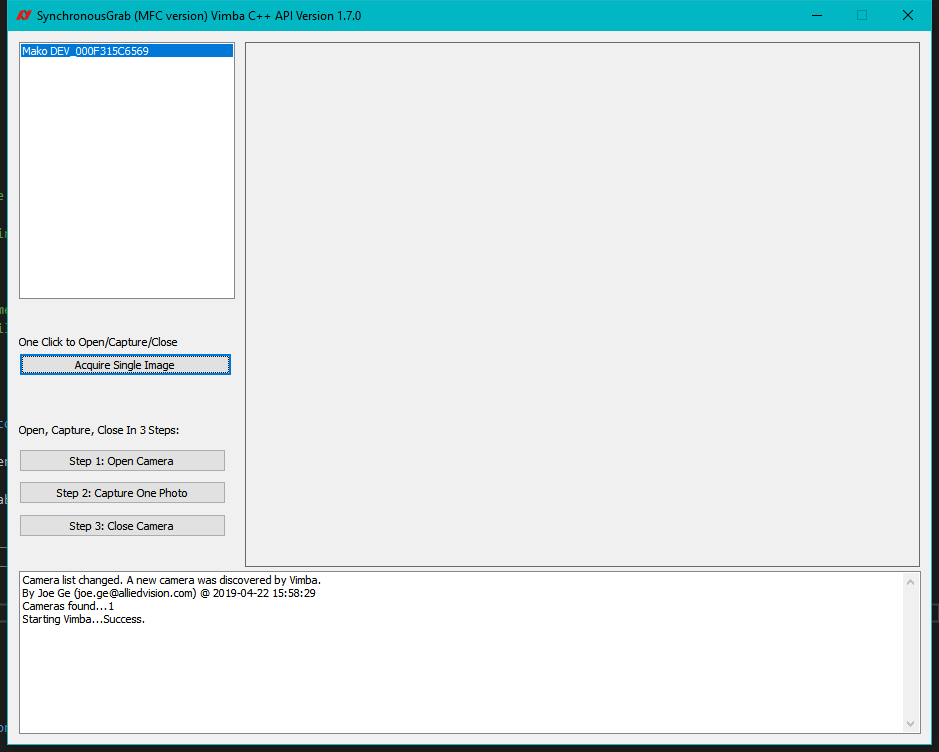
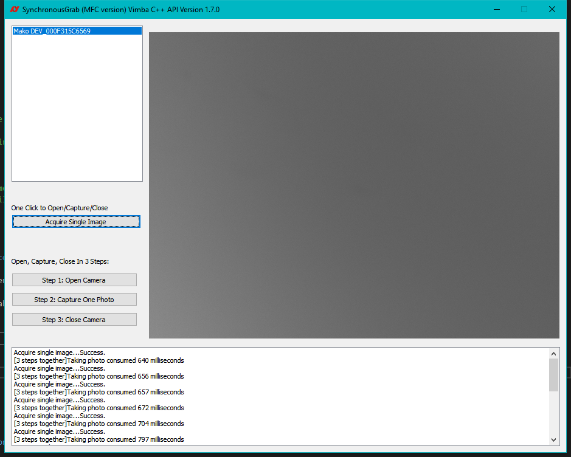
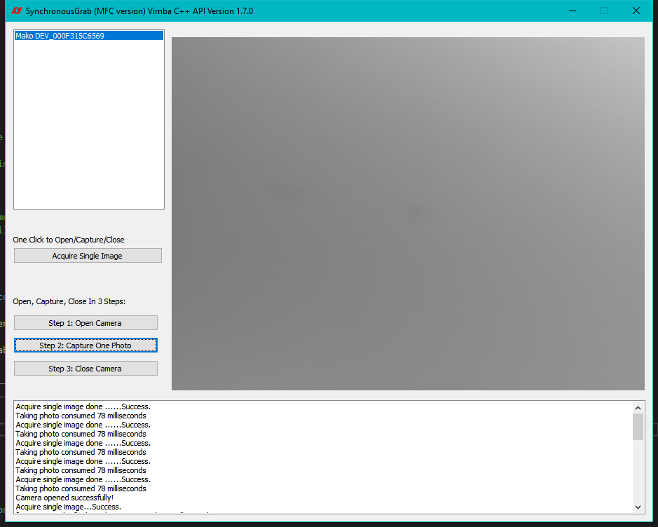

VimbaCPP_Examples\SynchronousGrab\MFC例子程序中 AcquireSingleImage() 函数改造
---

### 背景
VimbaCPP_Examples\SynchronousGrab\MFC 例子程序使用  AcquireSingleImage() 函数从相机中同步取图：        
```
err = m_pApiController->AcquireSingleImage( m_cameras[nRow], pFrame );
```
此处的AcquireSingleImage()函数做了如下动作：
```
VmbErrorType res = m_system.OpenCameraByID( ... ); 
res = m_pCamera->AcquireSingleImage( rpFrame, 2000 );
m_pCamera->Close(); 
```
由以上代码可以看出，`m_pApiController->AcquireSingleImage` 同步获取一幅图像的时间，包含了以下几个部分：
1. 打开相机
2. 同步拍照，并获取到图像
3. 关闭相机
   
实际编程时，如果需要连续多次拍摄图片，那么以上步骤中只需要重复第2步：同步拍照，并获取图像即可。并不需要每次都打开和关闭相机。


### 实际验证

#### 修改方法
这里我将原来的
```
err = m_pApiController->AcquireSingleImage( m_cameras[nRow], pFrame );
```
函数，分解为下面三个函数：
```
VmbErrorType AcquireSingleImageOpen(const std::string &rStrCameraID);
VmbErrorType AcquireSingleImageGrab(FramePtr &rpFrame);
void	     AcquireSingleImageClose();
```
这样如果多次取图拍照，只需要打开一次相机，然后一直使用 `AcquireSingleImageGrab()` 函数即可多次拍照取图了。


#### 修改示例
在原来的例子程序中，我将以上三个函数设计成三个按钮来对应。代码可以从下面链接下载： 
[SynchronousGrab-CPP-OnlyTakePhoto.zip](SynchronousGrab-CPP-OnlyTakePhoto.zip "优化版本代码"). 
[直接下载链接](https://github.com/avtcn/notes/raw/master/vimbasdk/vimba-cpp-synchronous-grab-mfc-refine/SynchronousGrab-CPP-OnlyTakePhoto.zip)

使用此示例代码时，请将其解压到类似如下目录位置：
```
C:\Users\Public\Documents\Allied Vision\Vimba_2.1\VimbaCPP_Examples\SynchronousGrab-CPP-OnlyTakePhoto\MFC
```


*Step1, Step2, Step3 分别对应打开相机，拍照，和关闭相机。*



*[Acquire Single Image]按钮拍照（使用50ms曝光）时，一张图片大概需要 650ms ~ 797ms*



*[Step1, Step2, Step3]按钮拍照（使用50ms曝光）时，一张图片大概需要 78ms*


### 结果分析
[Acquire Single Image]按钮拍照需要的总时间包含了打开相机，取图，关闭相机的三个步骤的总时间。
[Step1, Step2, Step3]按钮拍摄一张图片只需要点击[Step2: Capture One Photo]按钮即可，其耗费的时间就是真正拍摄一张图片的时间（曝光时间+图像数据网络传输时间），节省的时间主要是前面提到的打开相机和关闭相机的时间。


