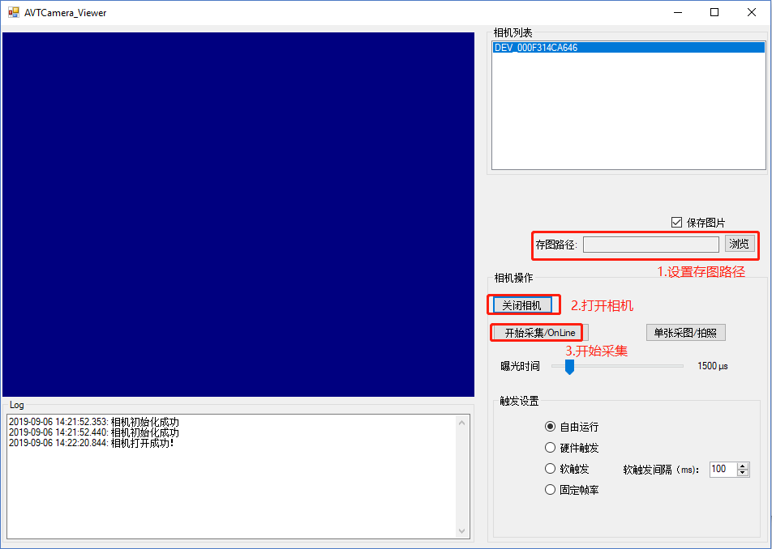

使用Vimba编程方法进行连续拍照高速存储
---

### 前言
最近有不少用户反馈AVT自带Vimba Viewer软件的存图功能不是很稳定，在连续存储几十张或几百张后出现不存图甚至软件崩溃的现象。其实，Vimba Viewer软件并非是专业的图像处理软件，主要是用来控制和调试相机参数的，图像存储涉及到磁盘I/O，并且和PC的磁盘读写速度有很大的关系。

### 以下是一个简单的通过二次开发实现的存图工具
#### 使用说明如下图

#### 工具下载链接
https://github.com/avtcn/notes/blob/master/vimbasdk/vimba_api_save_continous_photos/SaveImages.zip

#### 源代码下载链接
https://github.com/avtcn/notes/blob/master/vimbasdk/vimba_api_save_continous_photos/AVT_DemoCode_SaveImage.zip

### 其它说明
磁盘I/O涉及的的东西比较多，以上代码仅供参考，。如果想实现连续、稳定、高速的图片存储，我们建议采用市场上一些付费的商用软件(比如Streampix),或者利用Vimba SDK 提供的采图API自己进行二次开发。另外，如果本身磁盘读写速度比较慢（如机械硬盘），甚至小于相机的带宽，那就需要考虑更换硬件了。

### 修改历史
#### 1.By Lemon 2019.05.24 Manta G-125B 测试通过

### 联系方式
可以通过AVT技术邮箱：support@alliedvision.com 联系我们
