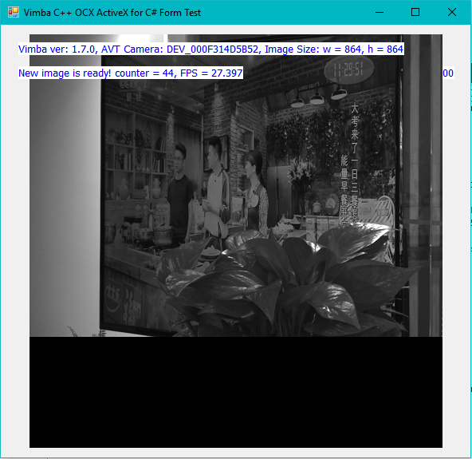

Vimba C++ API 实现MFC ActiveX OCX 控件并用于 VB/C#等
---

## 简介
为了在MFC ActiveX OCX 控件中实现Vimba C++采图功能，需要使用如下软件：
1. Vimba SDK 2.1.3(或者最新版本)
2. Visual Studio Community 2017(或者类似版本)

## ActiveX OCX 控件
实现代码及工程文件下载：[`MFCActiveXControl2.zip`](MFCActiveXControl2.zip)  

使用了Vimba C++ API 中异步取图功能，在相机是固定帧率，自由采集及硬件触发时此控件会实时显示收到的相机图像。

## 在VB/C#等使用OCX控件
测试C#代码及工程文件下载：[`ActivX-OCX-CSharp-Test.zip`](ActivX-OCX-CSharp-Test.zip)   

装上述生成的ActiveX OCX控件应用于C# Forms应用中。运行此程序时，系统上的第一个Allied Vision相机将实时显示它的图片在这个控件上。

## 实现效果
此空间可以实时显示相机传来的图片并显示，如下图，FPS是每秒显示的图片数量。

  

动态运行效果图： 

