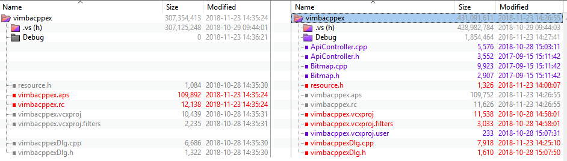

# Vimba C++ API 移植方法
如果你已经在你的软件中使用了其它相机API的C++接口，根据这份文档，你也可以轻松换成AVT相机的Vimba C++接口。

## Vimba C++ 例子程序介绍
Allied Vision Vimba SDK 2.1.3 C++ 代码移植示例。

## 例子代码
请访问：https://github.com/avtcn/vimba_cpp_example_port 

## 需要软件
* Visual Studio Community 2017 (http://www.visualstudio.com/) 或者类似版本
* Vimba SDK 2.1.3 (https://www.alliedvision.com/en/products/software.html) 或者类似版本

## 使用方法
可以使用Beyond Compare或者WinMerg(http://winmerge.org/) 比较两个下面两个目录：
* vimba_cpp_port-blank: Visual C++ 空白对话框工程
* vimba_cpp_port-works：在以上Visual C++工程中加入Vimba SDK代码调用的例子

## 其它信息
联系 support@alliedvision.com 获取更多帮助。

2018-11-23 14:55:29
by Joe Ge

